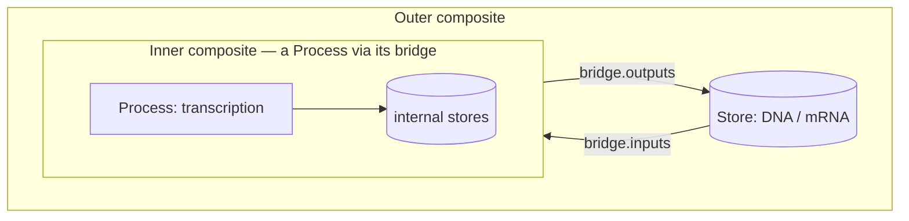
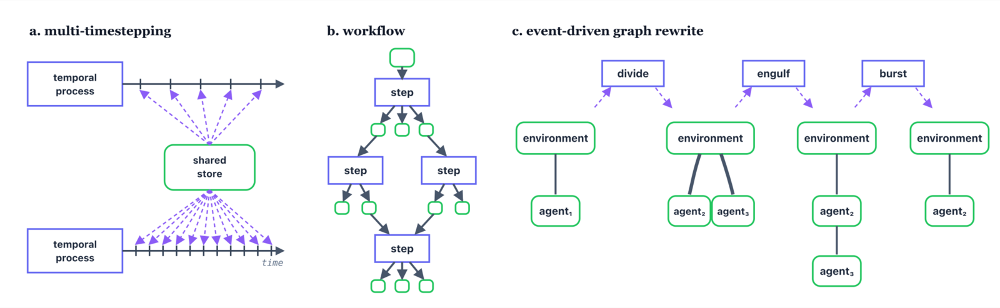
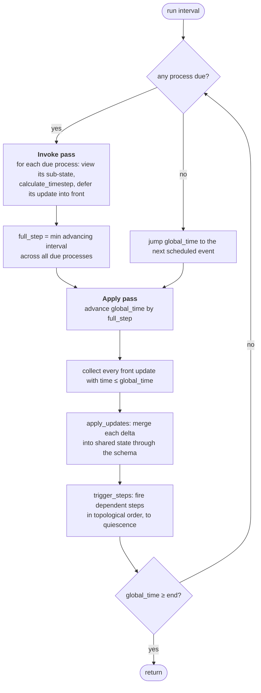

---
tags:
  - composite
  - wiring
  - process
  - step
---
# Composites & wiring

A [process or step](processes-and-steps.md) is just a rule. To *run* one you need stores
for it to read and write, other edges to couple it to, and a scheduler to advance time. All
of that is a **Composite** — the state-tree of typed nodes wired to shared stores that is
**the only object the engine actually runs**. This chapter is about the shape of that
document, how ports wire to store paths, how composites nest, and what happens on every
tick when you call `run`.

!!! info "On this page"
    **Assumes** [Processes & Steps](processes-and-steps.md).

    **You'll learn:**

    - The composite **document shape** — a `state` tree of `process` / `step` nodes
    - Wiring ports to shared-store **paths**, including relative paths like `['..']`
    - **Nesting** composites through the `bridge`
    - Running with `composite.run(interval)`
    - The **tick lifecycle** — the invoke pass, the apply pass, and how steps get triggered

## The composite document

A composite is a **document**: a plain Python dict (JSON-serializable) whose main key is
`state`. Inside `state`, some entries are plain **stores** — a typed value like a count or
a concentration — and some are **edge nodes**, each a `process` or `step` with an address,
config, and wiring:

```python
composite = Composite({'state': {
    'level': 1.0,                                    # a store — a plain typed value
    'grow': {                                        # an edge node
        '_type':    'process',                       # 'process' or 'step'
        'address':  'local:Grow',                    # protocol:name, resolved in the core
        'config':   {'rate': 0.5},                   # validated against the class's config_schema
        'interval': 1.0,                             # a process's timestep (steps omit this)
        'inputs':   {'level': ['level']},            # port → path into a shared store
        'outputs':  {'level': ['level']},            # port → path into a shared store
    },
}}, core=core)
```

Each field of an edge node has one job:

| Field | Meaning |
|---|---|
| `_type` | `'process'` (temporal, clocked) or `'step'` (reactive, dataflow). |
| `address` | `protocol:name`. `local:` resolves `name` in this core's link registry — so `local:Grow` needs `core.register_link('Grow', Grow)`. |
| `config` | Values validated and defaulted against the class's `config_schema`; read back as `self.config[...]`. |
| `interval` | A process's timestep. **Steps have no `interval`** — they fire on data change, not the clock. |
| `inputs` | A dict `{port_name: path}` mapping each input port to the store path it reads. |
| `outputs` | A dict `{port_name: path}` mapping each output port to the store path its delta is merged into. |

A **store** in the document is just a plain typed entry in `state` — `'level': 1.0`, or a
richer `{'_type': 'float', '_units': 'pg'}`. There is no special "store" keyword; anything
that isn't an edge node is state.

!!! info "Static vs generated documents"
    The document above is a *static* composite — you write the `state` dict out by hand or
    load it from a `.composite.json` file. The workbench also builds documents
    *programmatically* (a generator or `CompositeSpec` that assembles `state` from
    parameters), and *templates* leave holes — **sites** — to be filled later. Same
    document, filled two different ways; see
    [Templates & draft processes](templates-and-draft-processes.md).

## Wiring: ports to store paths

The coupling rule from [Core concepts](../foundations/core-concepts.md#structure-stores-edges-and-wires)
is worth restating exactly, because it is the whole model: **edges never talk to each other
directly.** They read and write shared stores, and *that shared wiring is the coupling.*

A **wire** is a **path** — a list of strings naming a location in the state tree:

- `['level']` targets `state['level']`.
- `['Env', 'x']` targets `state['Env']['x']` — the path descends into nested stores.

An edge node's `inputs` and `outputs` map each **port name** to such a path:

```python
'inputs':  {'level': ['level']},     # the 'level' port reads  state['level']
'outputs': {'level': ['level']},     # the 'level' port writes state['level']
```

Change a path and you rewire the model; point two edges' ports at the **same** path and
they are now coupled — one process's delta lands in the store the other reads, with no
direct reference between them. Nothing else connects edges.

<p class="viva-pull">Wiring is the coupling. To connect two processes you don't call one
from the other — you point their ports at the same store path.</p>

### Relative paths climb and descend

Paths are relative to the node that declares them, so a nested edge can reach **out** to a
parent store with `'..'` (one per level up) or **in** to a child store by naming it. The
repo's nested-compartment test wires an agent to both its parent environment and its own
inner compartment:

```python
'inputs': {
    'outer': ['..', '..'],           # climb two levels to the enclosing environment
    'inner': ['inner']},             # descend into this node's own inner store
'outputs': {
    'outer': ['..', '..'],
    'inner': ['inner']},
```

<small>Source: `tests.py::test_reaction` (`SimpleCompartment`).</small>

This is what makes **containment** work: an agent nested inside an environment inside
another agent can still read the field it lives in, without anyone flattening the hierarchy.
Wires may also contain `'*'`, matched across every key of a `map`-typed store — the pattern
used to wire a dynamic population of agents.

## Nesting: the bridge

Here is the structural payoff of the whole design: **a `Composite` is itself a
`Process`.** It owns an internal state-tree and scheduler, and it exposes external ports
through a **bridge** that maps those ports onto internal store paths. So a whole simulation
drops into a parent composite as a single node, wired exactly like any other edge.

The bridge is part of the composite's config — two wire-maps, one for each direction:

```python
'bridge': {
    'inputs':  {'DNA': ['DNA'], 'mRNA': ['mRNA']},    # external port → internal store path
    'outputs': {'DNA': ['DNA'], 'mRNA': ['mRNA']},
}
```

<small>Source: `tests.py::test_emitter` (a bridged Gillespie composite).</small>

`Composite.inputs()` and `outputs()` return the schema implied by the bridge wiring, so
from the outside the composite *is* a process with those ports. When it's used as a node
inside a bigger composite, its `update(state, interval)` projects the outer state onto its
bridge inputs, runs the interval internally, and returns its bridge outputs as a delta.



<p class="viva-pull">Multiscale models are built by containment, not by editing a monolith:
a cell composite drops into a colony composite the same way a process drops into a cell.</p>

This is the mechanism behind the framework's central slogan — *composition is closed*.
Because a composite is a process, a composite of composites is still a process, all the way
up. See [Core concepts](../foundations/core-concepts.md#composition-the-composite).

## Running a composite

You advance a composite by calling `run` with a span of time:

```python
composite.run(5.0)          # advance the simulation by 5 time units
```

`run(interval)` drives the tick loop until the requested time has elapsed. Two details
worth knowing:

- **A pure-Step network runs at `run(0.0)`.** With no process to advance the clock,
  "running" just means settling the [step DAG](processes-and-steps.md#steps-form-a-dataflow-dag-that-runs-to-quiescence)
  to quiescence — analyses and report cards over a fixed state fall in this case.
- **`run` is resumable.** Each call advances from the current `global_time`; calling it
  again continues where the last one stopped.

After a run, the composite's `state` holds the final values, `read_bridge()` views the
external output ports, and `timing_summary()` reports the split between time spent inside
processes and time spent in the framework itself.

### A complete, runnable example

Everything above, end to end — a `Grow` process over one shared store, an emitter recording
the trajectory each tick, and the results gathered back at the end:

```python
from process_bigraph import Composite, Process, allocate_core
from process_bigraph.emitter import emitter_from_wires, gather_emitter_results


class Grow(Process):
    config_schema = {'rate': 'float'}
    def inputs(self):  return {'level': 'float'}
    def outputs(self): return {'level': 'float'}
    def update(self, state, interval):
        return {'level': state['level'] * self.config['rate'] * interval}


core = allocate_core()
core.register_link('Grow', Grow)

composite = Composite({'state': {
    'level': 1.0,                                     # a shared store
    'grow': {'_type': 'process', 'address': 'local:Grow', 'config': {'rate': 0.5},
             'interval': 1.0, 'inputs': {'level': ['level']}, 'outputs': {'level': ['level']}},
    'emitter': emitter_from_wires({'level': ['level'], 'time': ['global_time']}),
}}, core=core)
composite.run(5.0)
print(gather_emitter_results(composite))
# {('emitter',): [{'level': 1.0, 'time': 0.0}, {'level': 1.5, ...}, ... {'level': 7.59, 'time': 5.0}]}
```

<small>Source: `README.md` quickstart.</small>

The `emitter` node is an ordinary `step` produced by the `emitter_from_wires` helper; it
observes the wired paths every tick and writes them to a sink. That whole story —
built-in emitters, how to retrieve results, how to write your own — is the next chapter.

## The tick lifecycle

Under `run`, time advances one **tick** at a time, and each tick is **two passes**. This is
the heart of the scheduler, and it's worth understanding because it explains why deltas
never collide and why steps fire exactly when they should.

<figure class="viva-figure">

<figcaption>The engine schedules three ways: <strong>multi-timestepping</strong> (temporal
processes at different intervals sharing a store), a <strong>workflow</strong> (a DAG of
steps run to convergence), and <strong>event-driven graph rewrite</strong> (divide/engulf
events changing the topology).</figcaption>
</figure>



**1 · Invoke pass.** For each process that is due, the composite *views* the sub-state that
process is wired to, asks it for its timestep (`calculate_timestep`), and stores a
**deferred** update in `self.front` — a per-process timeline dict, `{path: {'time':
next_due, 'update': ...}}` — tagged with the future time at which it applies. Crucially,
nothing is written to shared state yet; the process has only *returned a delta*. The pass
also accumulates `full_step`, the **minimum** advancing interval across all due processes,
so heterogeneous timesteps collapse into one shared advance.

**2 · Apply pass.** The composite advances `global_time` by `full_step`, collects every
`front` update whose scheduled time has now arrived (`time ≤ global_time`), and calls
`apply_updates`, which walks the schema and **merges each delta** into shared state through
its type's `apply` rule. Only now does state change. Then `trigger_steps` fires every step
whose input wires were just updated, in topological order, until the [step DAG
settles](processes-and-steps.md#steps-form-a-dataflow-dag-that-runs-to-quiescence).

If no process is due, time simply jumps to the next scheduled event rather than crawling.
The loop repeats until `global_time` reaches the requested end.

!!! note "Why two passes"
    Separating *invoke* (collect deltas) from *apply* (merge them) is what lets
    independently-written processes write to the same store in one tick without racing:
    every delta for a tick is gathered first, then merged together through the type's
    `apply` rule. It is the runtime-level expression of the
    [one merge law](../foundations/core-concepts.md#the-one-semantic-that-makes-it-compose).

!!! info "Scaling the loop — protocol batching"
    When many processes share one distributed runtime (for example, a grid of shards
    routed through a single Ray runtime), the per-process view-and-apply work can dominate
    the actual compute. A runtime can implement a `tick_lifecycle()` hook to take over the
    whole invoke-and-apply lifecycle for its processes and return **one** combined delta,
    collapsing N framework walks into one. Plain processes and runtimes without the hook
    keep the per-process path unchanged. Details in the repo's `docs/tick_lifecycle.md`.

## Where this sits

You now have the full computational spine: [types and state](schema-types-state.md) define
what stores can hold, [processes and steps](processes-and-steps.md) act on them, and a
composite wires them together and runs them. What's left is getting the numbers *out* of a
run — which is a job for a particular kind of step.

---

**Next:** [Emitters — getting data out](emitters.md)
