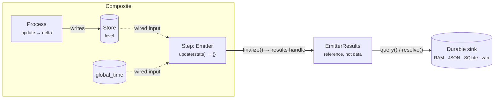

# Emitters — getting data out

A composite run produces a stream of state that never touches the disk on its own. The
engine advances stores, merges deltas, and moves on — nothing is kept unless something
asks to keep it. That something is an **emitter**: the Step that watches wired state and
writes it to a durable sink. When [Core concepts](../foundations/core-concepts.md) says a
run "emits a run store of trajectories," the emitter is the object doing the emitting.

!!! quote ""
    An emitter records wired state each tick into a durable sink — and it is the only part
    of a composite that is allowed to leave the run.

Because an emitter is a plain [Step](processes-and-steps.md), it inherits everything a Step
already is: it declares input ports, it is scheduled on the data-flow DAG, and it fires
when the state it depends on changes. What makes it an *emitter* is a two-line contract and
one discipline — it writes to a sink and it **never writes back into the simulation**.

## The emitter contract

Every emitter subclasses `process_bigraph.emitter.Emitter`, which is itself a `Step`. The
whole base class is small enough to read in one sitting:

```python
class Emitter(Step):
    '''Base emitter class: defines schema and stub methods.'''
    config_schema = {'emit': 'schema'}

    def inputs(self) -> Dict:
        return self.config['emit']

    def outputs(self) -> Dict:
        return {'results': 'node'}

    def query(self, paths=None, query=None):
        return {}      # subclasses return the recorded history

    def update(self, state) -> Dict:
        return {}      # subclasses record; the base no-op keeps it read-only
```

Four things are load-bearing here, and every built-in and custom emitter honours them:

| Element | What it means |
|---|---|
| `config_schema = {'emit': 'schema'}` | The emitter is configured by an **emit schema** — a description of the ports it observes. It is a *schema*, not data. |
| `inputs()` returns `self.config['emit']` | The input interface **is** the emit schema. Whatever you declare to emit is exactly what the emitter is wired to read. |
| `outputs()` returns `{'results': 'node'}` | One output port, `results`, carrying a **handle** — a reference to what was accumulated, not the data itself. |
| `update(state)` records, returns `{}` | Each tick it persists the observed `state` and returns an **empty delta**, so it can never feed state back into the run. |

The empty return is the discipline. A Step that returned a non-empty delta would be a
process-in-disguise, mutating the model it is supposed to be passively recording. An
emitter returns `{}` every tick — it is a pure sink.

!!! note "Why `results` is not written every tick"
    The `results` port is produced at **completion**, by `finalize()`, not by `update()`.
    Results are meaningful once — at the end of a run — and writing them each tick would
    re-fire every downstream consumer on every tick. `finalize()` returns
    `{'results': self.results(...)}`; `update()` stays silent. This is why an emitter can
    sit in a step network as an ordinary producer without flooding it.

### The results handle

`finalize()` hands back an `EmitterResults` — a durable **reference** to what the emitter
holds, carrying only the emitter's address, its path, a record count, and any context a
consumer needs to interpret it. The bulk data stays where it is until someone calls
`.resolve()`:

```python
handle = emitter.results()          # cheap: a reference, no data copied
rows = handle.resolve()             # pulls (and memoizes) the accumulated history
```

The point of the handle is that a downstream analysis or report-card Step can depend on the
emitter as a normal producer/consumer edge — and it "cannot tell a live emitter from a
pulled cache artifact," because both answer the same `kind` / `context` / `resolve()`
protocol. That symmetry is what lets a study **pull** a cached run or **compute** a fresh
one through the same wiring. (`EmitterResults.kind == 'trajectory'`.)

## The built-in emitters

Three emitters ship **inside** process-bigraph with no extra dependencies. Reach for these
first — they cover most of what you need while iterating.

| Emitter | Address | Sink | Reach for it when… |
|---|---|---|---|
| `ConsoleEmitter` | `local:ConsoleEmitter` | stdout | you want to *watch* a run print each tick while debugging |
| `RAMEmitter` | `local:RAMEmitter` | in-memory list | short runs; analysis in the same Python process |
| `JSONEmitter` | `local:JSONEmitter` | one JSON-Lines file per run | small-to-medium runs you want to keep on disk |

They differ only in where `update(state)` puts the row. `ConsoleEmitter` prints it;
`RAMEmitter` appends a `tree_copy` of it to `self.history`; `JSONEmitter` appends one JSON
object per line to `history_<simulation_id>.json`. All three expose the **same**
`query(paths=None)` API, so downstream plotting and analysis code never has to know which
one produced the trajectory.

!!! note "RAMEmitter has two knobs worth knowing"
    `subsample: N` records only every *N*th tick (default `1` = every tick), and `max_len:
    N` bounds `history` to the most recent *N* rows as a ring buffer (default `None` =
    unbounded). Both keep memory in check on long or heavy runs without distorting the time
    axis — each row still carries its true `global_time`.

### Heavier sinks live in `viva-emitters`

The database- and array-backed emitters were **extracted** out of process-bigraph into a
focused sibling package so they can carry their own optional heavy dependencies without
forcing them on every user:

| Emitter | Sink | Extra |
|---|---|---|
| `SQLiteEmitter` | one `.db` file, rows keyed by `simulation_id` | `viva-emitters[sqlite]` (stdlib only) |
| `ParquetEmitter` | hive-partitioned Parquet | `viva-emitters[parquet]` (duckdb, polars, …) |
| `XArrayEmitter` | a zarr store (`runs.<id>.zarr`) | `viva-emitters[xarray]` |

`process_bigraph.emitter` **re-exports** `SQLiteEmitter`, `ParquetEmitter`, and their
retrieval helpers lazily — so `from process_bigraph.emitter import SQLiteEmitter` keeps
working as long as the sibling package is installed. Install both backends at once via the
`process-bigraph[emitters]` extra.

!!! note "Package name: `viva-emitters` (formerly `pbg-emitters`)"
    The sibling package completed the `pbg → viva` rename. The canonical distribution is
    **`viva-emitters`** and its import package is **`viva_emitters`** — which is exactly what
    the re-export shim in `process_bigraph/emitter.py` imports (`import viva_emitters`). The
    old names still work: `import pbg_emitters` resolves to `viva_emitters` through a
    back-compat shim that emits a `DeprecationWarning`, so any older install instructions or
    docstrings that say **`pbg-emitters`** point at the same package. Prefer `viva_emitters`;
    verify against whatever is installed if in doubt. *(Verified against `viva-emitters`
    0.2.3.)*

    Two caveats to keep straight: **`XArrayEmitter` is not in the process-bigraph re-export
    set** — only `SQLiteEmitter`, `ParquetEmitter`, and their retrieval helpers are (see
    `_VIVA_REEXPORTS` in `process_bigraph/emitter.py`) — so import it from the emitters
    package directly, not from `process_bigraph.emitter`. And the `runs.<id>.zarr` filename is
    a run-store *convention* (how the study spine names a run store): `XArrayEmitter` itself
    takes an `out_uri` config key and writes wherever you point it, with no `runs.<id>.zarr`
    literal in its source — confirm the exact path against your config, not this table.

## Wiring an emitter

You almost never write an emitter's step spec by hand. Two helpers build it for you.

### Inline, with `emitter_from_wires`

The common case: declare the emitter alongside your processes when you build the composite.
`emitter_from_wires(wires)` takes a dict of `{name: path}` wires and returns a ready `step`
node — it derives the `emit` schema from the wires and sets the inputs to them:

```python
from process_bigraph import Composite, Process, allocate_core
from process_bigraph.emitter import emitter_from_wires, gather_emitter_results

class Grow(Process):
    config_schema = {'rate': 'float'}
    def inputs(self):  return {'level': 'float'}
    def outputs(self): return {'level': 'float'}
    def update(self, state, interval):
        return {'level': state['level'] * self.config['rate'] * interval}

core = allocate_core()
core.register_link('Grow', Grow)

composite = Composite({'state': {
    'level': 1.0,                                    # a shared store
    'grow': {'_type': 'process', 'address': 'local:Grow', 'config': {'rate': 0.5},
             'interval': 1.0, 'inputs': {'level': ['level']}, 'outputs': {'level': ['level']}},
    # record global_time and level every tick into a RAM emitter
    'emitter': emitter_from_wires({'level': ['level'], 'time': ['global_time']}),
}}, core=core)

composite.run(5.0)
print(gather_emitter_results(composite))
# {('emitter',): [{'level': 1.0, 'time': 0.0}, {'level': 1.5, ...}, ... {'level': 7.59, 'time': 5.0}]}
```

`emitter_from_wires(wires, address='local:RAMEmitter', subsample=1)` defaults to the RAM
backend; pass `address='local:ConsoleEmitter'`, `'local:JSONEmitter'`,
`'local:SQLiteEmitter'`, and so on to change the sink. The wires you pass **are** the
filter: the emitter only ever sees state you wired in, so unwired state is never copied.

### After the fact, with `add_emitter_to_composite`

When you have a composite someone else built — or you want to observe *every* wired
variable without listing them by hand — attach an emitter to the already-built object and
let it rebuild the step network:

```python
from process_bigraph.emitter import add_emitter_to_composite, gather_emitter_results

# 'all' observes every non-process, non-step port in state
composite = add_emitter_to_composite(composite, core, emitter_mode='all')
composite.run(10.0)
```

`emitter_mode` accepts `'all'` (every valid input port in state — the default), `'none'`
(only `global_time`), or `{'paths': [['Env', 'x'], 'target']}` (an explicit list). It
always adds `global_time`, so every trajectory has a time axis.



The dotted edges are the discipline made visible: state flows **into** the emitter, and the
only thing that flows out is a handle. No arrow ever runs from the emitter back into a
store.

## Reading the trajectory

Two entry points, depending on whether you hold the emitter or the composite.

**Per-emitter — `emitter.query()`.** Every emitter exposes the same `query(paths=None)`,
returning a list of per-tick dicts. Pass paths to project only the wires you want:

```python
emitter = composite.state['emitter']['instance']

history      = emitter.query()                          # full history, one dict per tick
times_only   = emitter.query([['time']])                # just the clock
x_and_target = emitter.query([['x'], ['Env', 'target']])# two named slices
```

**All emitters — `gather_emitter_results(composite)`.** Finds every `Emitter` instance in
the composite and returns `{path: history}`:

```python
from process_bigraph.emitter import gather_emitter_results

results = gather_emitter_results(composite)
for path, history in results.items():
    print(path, len(history), 'ticks')

# drive each emitter's query independently:
results = gather_emitter_results(composite, queries={('emitter',): [['Env', 'x']]})
```

!!! note "Two places to filter, and which to prefer"
    You can filter **at emit time** (the wires you pass to `emitter_from_wires` — the
    emitter never even sees unwired state) or **at query time** (`emitter.query(paths)` —
    the full tree was stored, you read a slice back). For long runs prefer emit-time
    filtering: less memory, smaller files, smaller database rows.

### Keeping runs on disk

`RAMEmitter` discards everything when the Python process exits. For runs you want to keep,
`SQLiteEmitter` appends one row per tick into a single `.db` partitioned by
`simulation_id`, and its retrieval helpers take **only a db path** — so you can analyse a
run weeks later without reconstructing the composite or importing the original processes:

```python
from process_bigraph.emitter import list_simulations, load_history, load_simulation_metadata

db_path = './out/history.db'
for sim in list_simulations(db_path):
    print(sim['simulation_id'], sim['name'], sim['step_count'])

history = load_history(db_path, 'run-2026-04-14-001')             # same shape as query()
only_x  = load_history(db_path, 'run-2026-04-14-001', paths=[['x']])
meta    = load_simulation_metadata(db_path, 'run-2026-04-14-001') # when it ran, its config
```

Useful config keys on the durable emitters: `file_path` / `db_file` (where), `simulation_id`
(defaults to a UUID), `subsample: N` (keep every *N*th tick), and `batch_size: N` (buffer
*N* rows per transaction to amortise fsync on high-frequency runs).

## Writing a custom emitter

An emitter is "just a `Step` subclass with an `inputs()` method that returns what to observe
and an `update(state)` method that records it." Subclass `Emitter`, keep the `emit` key in
your `config_schema`, persist in `update`, and return the list-of-dicts shape from `query`:

```python
import csv
from typing import Dict
from process_bigraph.emitter import Emitter

class CSVEmitter(Emitter):
    '''Append each tick to a CSV file.'''
    config_schema = {
        **Emitter.config_schema,                       # keep the 'emit' key
        'file_path':  {'_type': 'string', '_default': 'history.csv'},
        'fieldnames': {'_type': 'list[string]', '_default': None},
    }

    def __init__(self, config, core):
        super().__init__(config, core)
        self.file_path = config.get('file_path', 'history.csv')
        self.fieldnames = config.get('fieldnames') or list(self.inputs().keys())
        self._fh = open(self.file_path, 'a', newline='')
        self._writer = csv.DictWriter(self._fh, fieldnames=self.fieldnames)
        if self._fh.tell() == 0:
            self._writer.writeheader()

    def update(self, state) -> Dict:
        self._writer.writerow({k: state.get(k) for k in self.fieldnames})
        self._fh.flush()
        return {}                                      # empty delta: stays read-only

    def query(self, query=None):
        with open(self.file_path) as f:
            return list(csv.DictReader(f))
```

Register it under an address and use it exactly like any built-in:

```python
core.register_link('CSVEmitter', CSVEmitter)
# emitter_from_wires({...}, address='local:CSVEmitter')
```

The contract to satisfy, in one list:

- Accept `emit` in `config_schema` (inherit from `Emitter.config_schema`) — it is the
  schema of observed state.
- Implement `update(state)` to persist; return `{}` to stay read-only.
- Implement `query(paths=None)` to return a list of per-tick dicts, so it plugs into
  existing plotting and analysis code.
- If live process/edge objects can be wired into your state, reuse
  `process_bigraph.emitter.tree_copy` — it strips `Edge` instances before persistence,
  which is exactly what `RAMEmitter` and `SQLiteEmitter` do.

## Where emitters sit in the bigger picture

An emitter is the **durable phase boundary** of a study. Phase one is the temporal
simulation; the emitter writes the trajectory; phase two — the analyses, visualizations, and
report cards that grade the run — are all Steps that read the emitter's `results` handle.
That is why [Studies](../investigate/studies.md) tie each named readout to an exact store
path: the study's *emit contract* is a promise about what its emitter records, and the
verdict is computed from what actually came out. Getting the data out, cleanly and without
letting it leak back into the model, is the seam the whole agentic spine stands on.

---

**Next:** [Templates & draft processes](templates-and-draft-processes.md)
