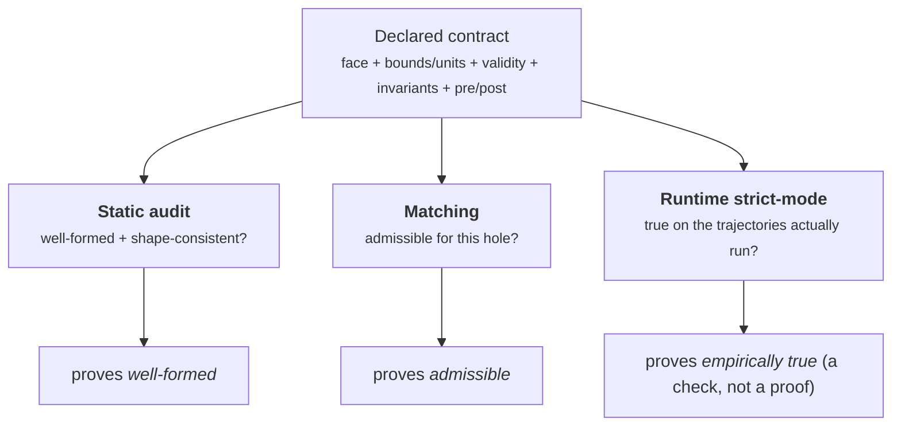

---
tags:
  - contract
  - process
  - audit
  - template
---
# Process contracts

A [process or step](processes-and-steps.md) always advertises a **face** — the input and
output ports it reads and writes. A **contract** is the face made *honest and checkable*: it
adds the bounds, units, and relationships a process promises to respect, so the framework can
tell whether a process *will* fit where you want to use it, whether its claims are
*well-formed*, and — when you ask — whether they are *actually true* on a run.

Contracts are **additive and opt-in**. A process that declares nothing is simply
unconstrained: it audits as "incomplete," matches on shape alone, and runs exactly as before.
Nothing about the default runtime changes.

## What a contract declares

Beyond the plain face, a contract can declare four kinds of condition, in a small, safe
expression language (it parses to an AST and is **never `eval`'d**):

| Kind | Means | Example |
|---|---|---|
| **port bounds / units** | a port's value stays in a range / carries a unit | `mass: float ≥ 0 [mg]` |
| **`validity`** | the configuration regime the process is valid in | `config.rate > 0` |
| **`invariant`** | a cross-port relation that holds every tick | `outputs.mass - inputs.mass <= tol` |
| **`pre` / `post`** | a precondition on inputs / a guarantee on outputs | `requires inputs.m >= 0`; `guarantees outputs.m >= 0` |

Conditions are added by **narrowing** — each one only ever *tightens* the contract, never
loosens it. A reference to a port or config key must resolve, an expression must parse, a
range must have `min ≤ max`, and a unit must be a real unit; a malformed condition is caught,
not run.

!!! note "Verified against code"
    The model lives in **bigraph-schema ≥ 1.7.0**: `ProcessContract` and
    `narrow_condition(contract, kind, expr, *, name, tol)` in `bigraph_schema/contract.py`
    (kinds `invariant` / `pre` / `post` / `validity`); the safe expression language in
    `bigraph_schema/contract_expr.py` (`parse` → AST, `evaluate`, `names_in` — no `eval`);
    the static auditor in `bigraph_schema/contract_audit.py`.

## Three layers that compose

The power of contracts is that three independent checks answer three different questions, and
they stack:

- **Static audit** proves a contract is *well-formed and shape-consistent* — without running
  anything.
- **Matching** proves a process is *admissible* for a given hole — before you wire it in.
- **Runtime strict-mode** proves the contract held *on the trajectories you actually ran* — a
  check on real behaviour, not a proof over all inputs.

Contracts are **not a theorem prover.** Face, bound, and unit matching are exact; matching on
invariants/pre-post is *structural* (a sound filter by shape, not semantic implication); and
strict-mode checks runs, not all possible runs. The system is honest about which guarantee
each layer gives.

## Static audit & the completeness grade

`audit_contract` walks a contract without running the process and returns findings
(`error` / `warning` / `info`) plus a **completeness grade** — how much of the contract is
actually declared versus left as bare, unconstrained ports. The grade is a score that feeds
the [rigor program](../investigate/rigor-and-evidence.md), **not** a gate: an unconstrained
process is "incomplete," not "wrong."

A companion **drift auditor** lints a process's `update()` itself (best-effort, by reading its
source): does it read only declared input ports and write only declared output ports? It also
catches the *no-op trap* — a non-draft process still carrying the inherited empty `update()`.
Because Python is dynamic this is a conservative lint, not a conformance proof.

!!! note "Verified against code"
    `audit_contract(core, contract)` and `completeness(contract)` in
    `bigraph_schema/contract_audit.py`; the drift auditor in
    `process_bigraph/contract_drift.py` (`audit_process_drift`, `audit_registry_drift`).

## Matching: finding what fits a hole

[Templates leave holes](templates-and-draft-processes.md) — a **site** records the face (and,
when declared, the contract) a filler must present. Contracts make the reverse question
answerable: *which registered processes would fit this hole?*

`find_candidates(core, site)` enumerates the process registry and returns the ones whose
declared contract **subsumes** the hole's — each result saying *why*: a **full** match, or a
**near-miss** with the exact failing condition. Near-misses are included on purpose, so you
see "this process fits except it doesn't guarantee mass conservation" instead of an empty
list.

| Group | Check | Exactness |
|---|---|---|
| face (ports) | provides every required port at a resolvable type | exact |
| bounds / units | candidate range ⊆ required; units convertible | exact |
| validity / invariants / pre-post | candidate *declares* a compatible guarantee | structural (sound filter) |

!!! note "Verified against code"
    `contract_subsumes` / `face_subsumes` in `bigraph_schema/subsumption.py`;
    `find_candidates(core, site)` → `CandidateMatch(address, match, over_provides, fails)` in
    `bigraph_schema/matching.py`.

## Runtime strict-mode

When you want the contract *enforced on a run*, turn on strict-mode. It is a core setting,
**`contract_strict ∈ {off, raise, record}`, off by default and zero-cost** — the normal run
path is untouched until you opt in.

When on, each process's step is wrapped: `pre` conditions and input-port bounds are checked
*before* `update()`; `post` + `invariant` conditions and output-port bounds are checked
*after*, against the reconstructed post-state (so a decrement never false-positives and a
conservation invariant means what you'd expect).

- **`raise`** halts the run fail-loud on the first violation — for development, CI, and
  validation runs.
- **`record`** emits a `contract.violation` event and keeps going — for production monitoring.

Expressions are compiled once at process init, not re-parsed per tick; a condition that can't
be evaluated (a missing binding, a division by zero) is skipped, never fatal.

!!! note "Verified against code"
    `process_bigraph/contract_strict.py` — the `{off, raise, record}` setting, read on the
    `Composite` step seam; off-mode is a single early return.

## Composites carry contracts too

A composite *is* a process, so it uses the **same** contract model: it exposes a boundary face
derived from its wiring and can declare its own richer `validity` / `invariants` /
`guarantees`. A composite also gets an **internal-consistency audit** for free from the
matching machinery — checking that what each member writes fits what the members reading it
require (bounds/units that build-time type-merging doesn't enforce), and that a declared
boundary-output override is consistent with what the members actually produce.

!!! note "Verified against code"
    `process_bigraph/composite_audit.py` (`audit_composite`).

## Seeing it in the workbench

The [workbench](../investigate/workspaces-and-workbench.md) surfaces contracts on the
**Registry and Catalog cards**: an **audit badge** (✓ passed / ✗ failed / ◐ incomplete / — no
contract) at a glance, and an **expandable contract panel** showing the declared ports with
bounds/units, the conditions, the completeness grade, and any findings. A **"find candidates"**
panel on the Registry tab lets you type an interface (inputs/outputs) and see which registered
processes fit it.

## Enforcing contracts in CI

`python -m process_bigraph.audit_contracts` audits every registered process and **exits
non-zero if any has an `error`-severity finding** — so a broken contract can't ship. Run it in
your workspace's CI; `--require-declared N` additionally fails when fewer than *N* processes
declare a real contract, making contract coverage visible.

!!! note "Verified against code"
    `process_bigraph/audit_contracts.py` — the `audit_all` sweep + the
    `python -m process_bigraph.audit_contracts` command (`--require-declared`,
    `--strict-resolve`, `--json`), with a pytest regression gate.

## Where to start

Declaring a contract is incremental — begin with the ports you most care about:

1. Add bounds/units to the input/output ports a reader actually depends on (`float ≥ 0`,
   `[mg]`).
2. Add one `invariant` or `guarantee` the process genuinely upholds (e.g. non-negativity,
   conservation).
3. Run `python -m process_bigraph.audit_contracts` (or open the workbench card) to see the
   badge turn from *incomplete* toward *passed*, and the completeness grade rise.
4. Turn on `contract_strict='raise'` for a validation run to confirm the claims hold on real
   trajectories.

Contracts repay adoption gradually: every port you constrain makes the process easier to
[match into a template](templates-and-draft-processes.md), easier to audit, and safer to
reuse.
