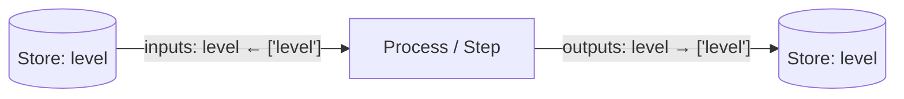

---
tags:
  - process
  - step
---
# Processes & Steps

A model in Vivarium is made of two things: **state** that lives in stores, and
**functionality** that acts on it. The functionality is packaged as **edges** — and there
are exactly two kinds, split by their relationship to time. This chapter shows you how to
write both, from the base-class contract down to real, runnable code.

!!! info "On this page"
    **Assumes** [Core concepts](../foundations/core-concepts.md) and [Schemas, types & state](schema-types-state.md).

    **You'll learn:**

    - What an **edge** is, and why it never talks to another edge directly
    - The `Process` contract — `config_schema`, `inputs()`, `outputs()`, `update(state, interval)`, `initial_state()`
    - The `@process` decorator shortcut that infers `config_schema` for you
    - How a **Step** differs from a Process, and how Steps form a dataflow DAG that runs to quiescence
    - Registering an edge with `core.register_link(name, cls)`

## What an edge is

In [Core concepts](../foundations/core-concepts.md) an **edge** is defined as a unit of
functionality attached to stores. Each of its inputs and outputs is a **port**. The rule
that makes the whole framework compose is that **an edge never talks to another edge
directly** — it reads and writes **shared stores**, and that shared wiring *is* the
coupling between edges.

That gives an edge a very small, very strict job:

<div class="viva-grid" markdown>

<div class="viva-card" markdown>
### :material-import: Read
The runtime hands `update()` a `state` dict whose keys are the edge's **input port
names**, with values pulled from the stores those ports are wired to.
</div>

<div class="viva-card" markdown>
### :material-calculator: Compute
The edge does its work — an integration step, an FBA solve, a unit conversion, a report
card — using only what it was given plus its own `config`.
</div>

<div class="viva-card" markdown>
### :material-export: Return a delta
It **returns** a dict keyed by **output port names**. It does *not* write anything itself.
The runtime merges that delta into shared state through the type's `apply` rule.
</div>

</div>



<p class="viva-pull">Because an edge only ever returns a delta, two independently-written
edges can write to the same store without knowing about each other. That is the one
semantic that lets the whole framework compose.</p>

The two kinds of edge differ in exactly one thing — **time**:

| | **Process** — *temporal* | **Step** — *reactive* |
|---|---|---|
| Declares an `interval`? | yes, a timestep | no |
| `update` signature | `update(self, state, interval)` | `update(self, state)` |
| When it runs | on its own interval schedule, driven by the clock | when its input wires change — a dataflow rule |
| Good for | ODE integrators, FBA steps, stochastic steps, agent dynamics | reactions, unit conversions, analyses, report cards, emitters |

## The `Process` base class

A **Process** is a temporal edge: it owns a timestep and advances dynamics over a span of
time. You write one by subclassing `process_bigraph.Process` and filling in a handful of
methods. Here is the canonical teaching process shipped in the repo (its one
`accelerate` helper trimmed, so only the contract shows):

```python
from bigraph_schema import make_default
from process_bigraph.composite import Process, Step


class IncreaseProcess(Process):
    config_schema = {
        'rate': {
            '_type': 'float',
            '_default': '0.1'}}

    def inputs(self):
        return {
            'level': 'float'}

    def outputs(self):
        return {
            'level': 'float'}

    def initial_state(self):
        return {
            'level': 4.4}

    def update(self, state, interval):
        return {
            'level': state['level'] * self.config['rate']}
```

<small>Source: `process_bigraph/processes/examples.py`.</small>

Each piece of that class is one clause of the Process contract:

### `config_schema` — a class attribute

`config_schema` is a **class attribute** (not a method) holding a
[bigraph-schema](schema-types-state.md) schema dict that describes the process's
configuration. Values are validated and defaulted against it, and the instance reads them
back at `self.config[...]`:

```python
config_schema = {'rate': {'_type': 'float', '_default': '0.1'}}
#   → self.config['rate'] is available inside update()
```

A bare type name is a valid shorthand — `config_schema = {'rate': 'float'}` — and
`bigraph_schema.make_default('float', 0.001)` builds a defaulted field for you.

### `inputs(self)` and `outputs(self)`

Two methods that return the **port interface** — a dict mapping each port name to a
[type expression](schema-types-state.md). Inputs declare what the process reads; outputs
declare what it may write:

```python
def inputs(self):  return {'level': 'float'}
def outputs(self): return {'level': 'float'}
```

The keys here are the same names that appear in the `state` dict passed to `update()` and
in the delta it returns. Port types can be as rich as the type system allows —
`'map[float]'`, `'array'`, `'map[mass:float]'`, or a dict carrying `_units`.

### `update(self, state, interval)` — the temporal step

This is where the dynamics live. `state` is a dict keyed by **input port names**, `interval`
is the timestep, and the return value is a **delta dict keyed by output port names**:

```python
def update(self, state, interval):
    return {'level': state['level'] * self.config['rate']}
```

The returned dict is a *change*, not a new value — the runtime merges it into the wired
store through that type's `apply` rule (numeric types accumulate, `set` replaces, dicts
merge). See [the merge law in Core concepts](../foundations/core-concepts.md#the-one-semantic-that-makes-it-compose).

### `initial_state(self)` — optional

If present, `initial_state()` returns the starting values this process contributes to the
stores it is wired to. When a composite is built, each edge's `initial_state()` is combined
into the global state, so a process can seed its own inputs:

```python
def initial_state(self):
    return {'level': 4.4}
```

!!! note "One more optional hook"
    `initialize(self, config)` lets a process precompute expensive state from its config
    (a loaded scientific model, a JIT cache, a solver base). The default `reconfigure()`
    re-runs `initialize`, which is what lets a pooled actor be re-purposed per-sim without
    a cold start. Most processes never need either — `config_schema` is enough.

## The `@process` decorator shortcut

When a process is a **pure typed function** of `(state, interval)` plus some
configuration, you don't need the class boilerplate at all. The `@process` decorator turns
a function into a `Process` subclass and **infers `config_schema` from the function's
keyword-only arguments**:

```python
from process_bigraph import allocate_core, Composite, process


@process(inputs={"S": "float"}, outputs={"S": "float"})
def decay(state, interval, *, rate: float = 0.1):
    return {"S": -rate * state["S"] * interval}   # additive delta
```

<small>Source: `notebooks/tutorial_0_quickstart.ipynb`.</small>

The keyword-only parameters after `*` **are** the config: `rate: float = 0.1` becomes a
`float` field defaulting to `0.1`. The inferred schema is available on the class:

```python
decay.config_schema     # → the inferred {'rate': {'_type': 'float', '_default': 0.1}}
```

Python-scalar annotations map onto bigraph types (`float → 'float'`, `int → 'integer'`,
`bool → 'boolean'`, `str → 'string'`); a *string* annotation is taken verbatim as a type
name, which is the escape hatch for richer types like `"map[float]"`. The class-based
`Process` remains the escape hatch for anything stateful.

!!! warning "Accuracy note — register with `register_link`, not `register_process`"
    The `@process` docstring says to register the class with
    `core.register_process(name, cls)`. **That method does not exist.** The real registrar
    on the `Core` is `core.register_link(name, cls)`, and every working call site — the
    README, the tests, the emitter docs — uses `register_link`. Treat `register_process`
    as a docstring typo.

## `Step` vs `Process`

A **Step** is the reactive edge. Its docstring calls it *"a stateless, non-temporal
computational unit … triggered when its data dependencies are satisfied, functioning like
a reaction or transformation rule."* The single visible difference is that **`Step.update`
takes no `interval`**:

```python
class OperatorStep(Step):
    config_schema = {'operator': 'string'}

    def inputs(self):
        return {'a': 'float', 'b': 'float'}

    def outputs(self):
        return {'c': 'float'}

    def update(self, inputs):          # note: no interval
        a = inputs['a']
        b = inputs['b']
        if self.config['operator'] == '+':
            c = a + b
        elif self.config['operator'] == '*':
            c = a * b
        elif self.config['operator'] == '-':
            c = a - b
        return {'c': c}
```

<small>Source: `process_bigraph/processes/examples.py`.</small>

### Steps form a dataflow DAG that runs to quiescence

A Process runs on the clock. A Step runs when **its inputs change**. Because a Step's
inputs and outputs are wired to shared stores, the composite can read off which steps
depend on which — a step that writes store `y` comes before a step that reads `y` — and
build a **dependency DAG**. When the state a step depends on changes, the network fires in
topological order and **settles to quiescence** before time advances.

The clearest proof of this is a test in the repo: three steps chained `a → b → c`, where
`step_a` writes `y`, `step_b` reads `y` and writes `z`, and `step_c` reads `z`:

```python
class ProducerStep(Step):
    config_schema = {'name': 'string'}
    def inputs(self):  return {'in_val': 'float'}
    def outputs(self): return {'out_val': 'float'}
    def update(self, state):
        execution_log.append(self.config['name'])
        return {'out_val': state.get('in_val', 0.0) + 1.0}

core = allocate_core()
core.register_link('ProducerStep', ProducerStep)

composite = Composite({'state': {
    'x': 1.0, 'y': 0.0, 'z': 0.0,
    'step_a': {'_type': 'step', 'address': 'local:ProducerStep', 'config': {'name': 'a'},
               'inputs': {'in_val': ['x']}, 'outputs': {'out_val': ['y']}},
    'step_b': {'_type': 'step', 'address': 'local:ProducerStep', 'config': {'name': 'b'},
               'inputs': {'in_val': ['y']}, 'outputs': {'out_val': ['z']}},
    'step_c': {'_type': 'step', 'address': 'local:ProducerStep', 'config': {'name': 'c'},
               'inputs': {'in_val': ['z']}, 'outputs': {'out_val': ['w']}},
}}, core=core)

composite.run(0.0)                     # a pure-step network settles at interval 0

assert execution_log == ['a', 'b', 'c']
assert composite.state['w'] == 4.0     # a:1→2, b:2→3, c:3→4
```

<small>Source: `tests.py::test_dependency_cycle`.</small>

Two things to notice. First, the wiring alone determines the order — nobody wrote a
schedule. Second, a network made only of steps runs to completion at **`run(0.0)`**: with
no process to advance time, "run" just means "settle the DAG." This is exactly why
**emitters, analyses, visualizations, and report cards are all Steps** — each should fire
whenever the state it observes is ready, not on a clock of its own.

!!! tip "By default, every input triggers"
    A Step re-fires when *any* of its input wires updates. Override `triggers()` to return
    only a subset of ports if some inputs should be *received but silent* (read without
    causing a re-trigger). There is also a `@step` decorator — the exact analogue of
    `@process`, with an `update(state)` that takes no interval.

## Registering an edge

Whether class-based or decorated, an edge becomes usable by **registering it into a
`Core`** under the name that its `address` will reference:

```python
from process_bigraph import allocate_core

core = allocate_core()                 # a fresh, isolated type + link registry
core.register_link('Grow', Grow)       # now 'local:Grow' resolves to this class
core.register_link('decay', decay)     # decorated processes register the same way
```

`allocate_core()` returns a fresh, **isolated** `Core` — types and links registered on one
core never leak to another, so two composites in the same process can't collide. Discovery
is lazy: a registered link's module is only imported when an `address` first resolves to
it. In a document, an edge names its class through an `address` like `local:Grow` —
`local:` means "resolve this name in this core's registry."

!!! warning "Accuracy note — the registry is on bigraph-schema's `Core`"
    Composites are built on a `Core` produced by `allocate_core()` (from `bigraph_schema`),
    not on a legacy `TypeSystem` object. `core.register_link(name, cls)` is the one and
    only method for registering a process or step class. See
    [Schemas, types & state](schema-types-state.md) for what else the `Core` holds.

## Putting it together

A process or step on its own is inert — it needs stores to read and write, and a composite
to schedule it. Here is the full loop, using a class-based `Grow` process wired over a
single shared store, with an emitter recording the trajectory:

```python
from process_bigraph import Composite, Process, allocate_core
from process_bigraph.emitter import emitter_from_wires, gather_emitter_results


class Grow(Process):                                  # a Process = ports + an update
    config_schema = {'rate': 'float'}
    def inputs(self):  return {'level': 'float'}
    def outputs(self): return {'level': 'float'}
    def update(self, state, interval):
        return {'level': state['level'] * self.config['rate'] * interval}  # a delta


core = allocate_core()
core.register_link('Grow', Grow)                      # register it in the local registry

composite = Composite({'state': {
    'level': 1.0,                                     # a shared store
    'grow': {'_type': 'process', 'address': 'local:Grow', 'config': {'rate': 0.5},
             'interval': 1.0, 'inputs': {'level': ['level']}, 'outputs': {'level': ['level']}},
    'emitter': emitter_from_wires({'level': ['level'], 'time': ['global_time']}),
}}, core=core)
composite.run(5.0)
print(gather_emitter_results(composite))
```

<small>Source: `README.md` quickstart.</small>

That `{'state': {...}}` document — the stores, the `process`/`step` nodes, and the wiring
between them — is the subject of the next chapter. How the emitter records state, and how
you get the trajectory back out, is covered in [Emitters](emitters.md).

---

**Next:** [Composites & wiring](composites-and-wiring.md)
