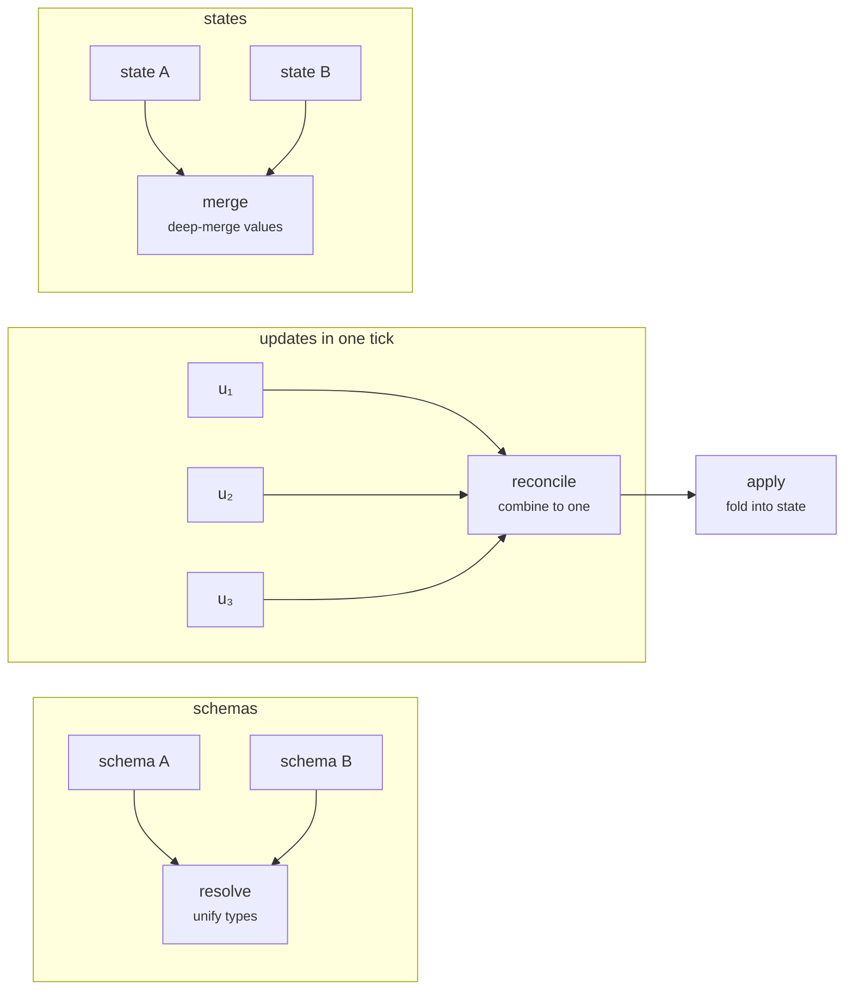

---
tags:
  - schema
  - types
  - state
---
# Schemas, types & state

The `bigraph-schema` layer sits at the bottom of the stack. It answers one question
before anything runs: **what can state be, and how do changes to it combine?** Every
Store in a Vivarium model holds a value that this layer has typed, and every delta a
Process returns is merged back into that state by a rule this layer owns. Get the type
system right and independently-written simulators compose without knowing about each
other; get it wrong and nothing above it can be trusted.

This chapter is the working reference for that layer. It builds on the vocabulary from
[Core concepts](../foundations/core-concepts.md) — stores, schema/state separation,
deltas, `apply`, and the site/fill/ground story — and turns it into the concrete API you
call. If you have not read Core concepts, start there; this chapter assumes you know *why*
deltas merge and focuses on *how* the machinery works.

!!! info "On this page"
    **Assumes** [Core concepts](../foundations/core-concepts.md). · **You'll learn** the type-string grammar, the `Core` registry, how `apply` merges deltas, and why schema and state stay separate.

!!! quote ""
    A **schema** is a map from paths to types; a **state** is a map from paths to values.
    The schema is the typed blueprint; the state is one thing that inhabits it. Keeping the
    two separate is what lets you validate, reuse, and reason about a model independently of
    running it.

## What `bigraph-schema` is

`bigraph-schema` "provides a serializable type schema for compositional and multiscale
modeling … the foundation of the Vivarium 2.0 simulation framework." Concretely it is
three things wearing one coat:

<div class="viva-grid" markdown>

<div class="viva-card" markdown>
### A type language
A compact string grammar — `float`, `map[float]`, `array[(3|4),float]`,
`link[x:int|y:string]` — plus a set of base types (scalars, containers, wiring types,
Milner's structural types) that the grammar composes.
</div>

<div class="viva-card" markdown>
### A registry
The **`Core`** object: a registry of types, edges (links), and methods that the engine
consults. You register a new type or process class once and every operation knows about it.
</div>

<div class="viva-card" markdown>
### A reversible codec + algebra
Type-aware operations — `check`, `default`, `serialize`/`realize`, `apply`,
`resolve`/`reconcile`, `traverse` — that all dispatch on the compiled type, translating
between a compiled (in-memory) and an encoded (JSON-compatible) representation.
</div>

</div>

Its place in the stack is to supply **Schema**, **State**, and **Update** and the algebra
that relates them; [`process-bigraph`](processes-and-steps.md) builds the Composite,
Process, and Step on top:

| Layer | What it is | Key operations |
|---|---|---|
| **Schema** `S` | a tree of type declarations | `check`, `default`, `realize` |
| **State** `X(S)` | a value inhabiting a schema | built from defaults; mutated by `apply` |
| **Update** `U(S)` | a value representing a change | combined by `reconcile`; consumed by `apply` |
| **Process / Edge** `P` | reads state, emits updates | invoked per-tick |
| **Composite** `C` | state containing processes | one tick = read → reconcile → apply |

!!! warning "Accuracy note — this is the rewritten API"
    `bigraph-schema` was substantially rewritten (this guide tracks **v1.4.x**). If you
    find older tutorials referring to a **`TypeSystem`** class, a single `type_system.py`,
    or type definitions as dicts of string-keyed `_apply`/`_serialize`/`_check` methods —
    **that API is gone.** There is no `TypeSystem` class in this tree. Today:

    - Base types are Python **dataclasses** subclassing `Node`.
    - Type behaviors are [`plum`](https://beartype.github.io/plum/)-dispatched
      **multimethods**, one module per operation under `bigraph_schema/methods/`, each
      specializing on the dataclass type — not string keys on a type dict.
    - The operational front door is the **`Core`** object, built with `allocate_core()`.

    The `_`-prefixed names survive only as (a) dataclass **schema fields** (`_type`,
    `_default`, `_value`, `_inputs`, …) and (b) on-the-wire **update sentinels** (`_add`,
    `_remove`, `_divide`) that the `apply` router dispatches to method modules. The
    *concepts* from [Core concepts](../foundations/core-concepts.md) are stable; verify
    *code* against the current package.

!!! note "A note on the name"
    Unlike most of the ecosystem, this package was **not** renamed in the pbg→viva sweep.
    The import is `import bigraph_schema`, the PyPI distribution is `bigraph-schema`, and
    the repo stays at `vivarium-collective/bigraph-schema` — it is kept under its upstream
    name as a foundation. See [A note on names](../foundations/the-stack.md#a-note-on-names).

## The `Core` object

`Core` is a registry plus the operations that consult it. You almost always build one with
`allocate_core()`:

```python
from bigraph_schema import allocate_core

core = allocate_core()      # base types + all discovered packages, as an isolated copy
```

`allocate_core()` builds a base `Core` seeded with the `BASE_TYPES` registry, runs package
discovery (it walks installed distributions and auto-registers any types, edges, or
visualizers they advertise), caches that, and hands back an **isolated copy**. Isolation
is the point: registering a type, link, or method on one core never leaks into another.

<div class="viva-grid" markdown>

<div class="viva-card" markdown>
#### `core.registry`
string key → type (a `Node` class, instance, or dict). The type namespace.
</div>

<div class="viva-card" markdown>
#### `core.link_registry`
string key → edge class. Where process/step classes live so a `link` can name one.
</div>

<div class="viva-card" markdown>
#### `core.method_registry`
string key → callable. Extension hooks the operations can call by name.
</div>

</div>

```python
def test_allocate_core_isolation():
    a = allocate_core()
    b = allocate_core()

    # Mutable containers and caches are distinct objects per instance.
    assert a.registry is not b.registry
    assert a.link_registry is not b.link_registry

    # Both copies carry the shared base types.
    assert 'float' in a.registry and 'float' in b.registry

    # Mutating one must not leak into the other.
    a.register_type('zzz_isolation_probe', 'float')
    assert 'zzz_isolation_probe' in a.registry
    assert 'zzz_isolation_probe' not in b.registry
```
<small>Abridged from `tests.py::test_allocate_core_isolation` (which also asserts
`method_registry` and the internal caches are distinct, and probes link/method isolation).</small>

!!! tip "Why isolation matters"
    A study, a composite, and a scratch experiment can each hold their own `Core` and
    register bespoke types without stepping on one another. When you need the shared base
    plus package-discovered types, use `allocate_core()`. When you want *only* the base
    types with no discovery (tests, tight control), you can construct `Core(BASE_TYPES)`
    directly — but `allocate_core()` is the normal path.

### Registering types, links, and methods

```python
core.register_type('my_conc', 'map[float]')        # any schema form is accepted
core.register_link('my_process', MyProcessClass)   # an Edge subclass
core.register_method('m', lambda core, *a, **k: ...)
```

`register_type(key, data)` accepts a string expression, a dict, or an already-compiled
`Node`. If the key already exists it **deep-merges** the new definition over the old one
(via `resolve`, below) rather than clobbering it — so a package can extend a type another
package registered. `register_types`, `register_links`, and `register_method` are the
bulk / edge / hook variants.

## Three ways to declare a schema

A schema is a type declaration, and you can write it three ways. All three normalize to
the same compiled `Node` through **`core.access()`** — which is the single funnel every
operation passes its schema argument through.

=== "1 · String DSL"

    A compact expression parsed by a `parsimonious` grammar:

    ```python
    core.access('float')
    core.access('map[float]')
    core.access('array[(3|4),float]')
    core.access('link[x:integer,y:string]')
    core.access('tree[float]')
    ```

    The grammar composes types:

    | Syntax | Meaning |
    |---|---|
    | `foo[A,B,C]` | parameterize — `A,B,C` fill the type's schema fields in order |
    | `a\|b\|c` | **merge** — dicts merge into one mapping; non-dicts form a `Tuple` |
    | `a~b~c` | **union** — becomes `Union(_options=[…])` |
    | `key:subtype` | **nest** — becomes `{key: subtype}` |
    | `(…)` | group |
    | `type{default}` | default block — `float{5.5}`, `string{hello}`, `integer{11}` |

    So `array[(3|4),float]` is an array whose shape parameter is the merge `(3|4)` and
    whose data type is `float`; `link[x:integer,y:string]` is an edge with two typed input
    ports.

=== "2 · Dict"

    A dict with underscore-prefixed **schema keys** (`_type`, `_default`, `_key`, …),
    and/or a structured dict of named sub-schemas:

    ```python
    node_schema = {
        'a': {'_type': 'float',  '_default': 11.111},
        'b': {'_type': 'string', '_default': 'hello world!'},
        'c': 'array[(3|4),U36]'}

    map_schema = {
        '_type': 'map',
        '_key': 'string',
        '_value': 'float'}
    ```
    <small>From `tests.py` (`node_schema`, `map_schema`).</small>

    A key that starts with `_` is a **schema key** (metadata about the type); any other key
    is a named child in the place graph. That is the whole rule (`is_schema_key` = "starts
    with `_`").

=== "3 · Compiled `Node`"

    An already-compiled dataclass instance — what `access` returns. Passing one back in is
    a no-op, which is why operations can accept any of the three forms interchangeably:

    ```python
    node_type = core.access(node_schema)   # dict  -> Node
    same      = core.access(node_type)     # Node  -> Node (idempotent)
    ```

!!! note "`access` is the great normalizer"
    Every `Core` method that takes a schema calls `access` on it first. That is why you can
    hand `core.default`, `core.check`, `core.serialize`, `core.traverse`, and the rest
    either a terse string, a verbose dict, or a compiled `Node` and get the same behavior.
    Write schemas in whichever form is clearest for the reader.

### Base types

`BASE_TYPES` seeds the registry with a family of dataclasses, all subclassing `Node`. The
exact set drifts as the package grows, so treat this as the shape of the family, not a
closed list:

<div class="viva-grid" markdown>

<div class="viva-card" markdown>
#### Scalars / atoms
`empty`, `boolean` (and `or`/`and`/`xor`), `integer`, `float`/`float64`, `number`,
`complex`, `delta` (a float used for additive updates), `nonnegative`, `range`, `string`,
`enum`, `dtype`. `number` carries `_units` (a pint string) and `_bits`, so `integer[64]`
and `float[32]` are spellable.
</div>

<div class="viva-card" markdown>
#### Wrappers
A `Wrap` holds an inner `_value` node and changes its behavior: `maybe` (nullable, default
`None`), `overwrite` (apply replaces), `const` (apply is a no-op), `quote` (opaque
passthrough), plus divide-behavior wrappers (`divide_reset`, `divide_share`,
`lineage_seed`).
</div>

<div class="viva-card" markdown>
#### Containers
`list`, `set`, `map` (`_key`+`_value`), `tree` (a `_leaf` type nested arbitrarily deep),
`array` (numpy `_shape`+`_data`+`_units`), `dataframe`, `tuple`, `union`.
</div>

<div class="viva-card" markdown>
#### Wiring & runtime types
`path` (a wire address — apply replaces, not concatenates), `wires`, `schema`, and
**`link`** (the edge node with `_inputs`/`_outputs` port types and `inputs`/`outputs`
wires). Plus `quantity` (a pint value), `function`, `object`, `random_state`.
</div>

</div>

The **Milner structural types** — `site` (a hole in the place graph), `inner_name` /
`outer_name` (open link-graph endpoints), and `face` (an interface `⟨m, X⟩`) — are what
turn a grounded schema into a composable context. They are the formal backbone of the
site/fill/ground story from [Core concepts](../foundations/core-concepts.md#from-documents-to-templates-sites-fill-and-ground).

!!! note "Type inheritance"
    Types inherit two ways. **Python class inheritance** among the dataclasses drives
    method dispatch — `Delta ⊂ Float ⊂ Number ⊂ Atom ⊂ Node`, so a method defined for
    `Number` covers `Float` unless overridden. **Schema-level `_inherit`** lets a
    *registered* type extend others: a dict with `{'_inherit': [ancestor, …], …}` resolves
    each ancestor left-to-right, then its own fields override.

## Producing state: `default` and `realize`

A schema describes what is possible; you still need an actual value. Two entry points make
one.

### `default` — the type's zero

`core.default(schema)` returns `(compiled_schema, state)` where `state` is the type's zero
value: `Float→0.0`, `Integer→0`, `String→''`, `Boolean→False`, `Map→{}`, `Tree→` its
leaf's zero (`tree[float]→0.0`; an empty tree with no leaf value is `{}`),
`List→[]`, `Array→np.zeros(shape, dtype)`, `Enum→` its first value, `Maybe→None`. An
explicit `_default` field always wins over the zero.

```python
default_schema, default_state = core.default(node_schema)
assert default_state['a'] == 11.111          # the declared _default
assert isinstance(default_state['b'], str)
assert core.check(node_schema, default_state) # the default inhabits its schema
```
<small>From `tests.py::test_default`.</small>

### `realize` — generate / fill / complete

`realize` is the workhorse: given a schema and a *partial* state, it decodes existing
values to their declared types and fills every missing key with a default. It is the
canonical "complete this graph" entry point, and it runs in **two phases** — first a
`discover` pass walks the state, coerces present values, and collects the defaults a
`link`'s wired ports declare; then the fill pass supplies missing keys using those
port-enhanced defaults. That split is why a wire like `'float{5.5}'` can override a bare
schema default.

```python
schema = {
    'A': 'float',
    'B': 'enum[one,two,three]',
    'D': 'string{hello}',
    'units': 'map[number]'}

state = {
    'C': {'_type': 'enum[x,y,z]', '_default': 'y'},
    'concentrations': {'glucose': 0.5353533},
    'link': {
        '_type': 'link',
        '_inputs':  {'n': 'float{5.5}', 'x': 'string{what}'},
        '_outputs': {'z': 'string{world}'},
        'inputs':   {'n': ['A'], 'x': ['E']},
        'outputs':  {'z': ['F', 'f', 'ff']}},
    'units': {'meters': 11.1111, 'seconds': 22.833333}}

generated_schema, generated_state, _ = core.realize(schema, state)

assert generated_state['A'] == 5.5               # filled from the wired port default
assert generated_state['B'] == 'one'             # enum default = first value
assert generated_state['C'] == 'y'               # explicit _default wins
assert generated_state['units']['seconds'] == 22.833333
```
<small>From `tests.py::test_generate` — the single best "everything together" example:
bare types, enum/string defaults, an embedded wired `link`, and a `map`, all completed in
one call.</small>

`realize` returns a **triple** — `(schema, state, escape_merges)` — where the third element
carries any *escaped* port merges: merges whose wires point outside the realized subtree,
handed back for the caller to apply at a higher scope. For a top-level `realize` (the usual
case) nothing escapes, so it is empty — which is why the examples here bind it to `_`. A
related helper, `core.fill(schema,
state, overwrite=False)`, builds the default state and merges your partial state over it
(or under it, if `overwrite`); `process-bigraph`'s `Edge.__init__` uses it to complete a
process's config.

!!! tip "`infer` — schema from an example"
    Going the other way, `core.infer(state)` derives a schema that a given value inhabits.
    It round-trips with `default`: `core.default(core.infer(value))[1] == value` (the
    state element of the `(schema, state)` pair `default` returns).

## Serialize / render — the codec, and its round-trip law

There are two directions to encode, and it helps to keep them straight:

- **`serialize(schema, state)`** encodes a *state value* to something JSON-compatible.
- **`render(schema, defaults=False)`** encodes a *schema* (a `Node`) to JSON/string — it
  is the inverse of `access`.

```python
link_type  = core.access(link_schema)
encoded    = core.serialize(link_type, link_a)
assert encoded['address']  == 'local:edge'
assert encoded['_inputs']  == 'mass:float|concentrations:map[float]'
```
<small>From `tests.py::test_serialize` — note the port schema serializes back to the same
compact DSL string you could have typed.</small>

The important guarantee is the **access ⇄ render inverse law**: normalizing a schema and
rendering it back are inverses, so a schema survives a round trip through JSON unchanged.

```python
def do_round_trip(core, schema):
    type_      = core.access(schema)               # string/dict -> Node
    reified    = core.render(type_, defaults=True) # Node -> JSON
    round_trip = core.access(reified)              # JSON -> Node
    final      = core.render(round_trip, defaults=True)
    return type_, reified, round_trip, final
```
<small>From `tests.py::do_round_trip`. `test_render` asserts
`core.access(link_render) == link_type` and that rendering reaches a fixed point.</small>

The decode direction is `realize`, and it is forgiving: it will parse JSON *strings* found
where structured values are expected. Feed a wire as the literal string `'["cell",
"internal"]'` and `realize` parses it back into a list; feed `'5555'` where an `integer`
is declared and you get `5555`.

```python
schema = {'a': 'integer', 'b': 'tuple[float,string,map[integer]]'}
code   = {'a': '5555', 'b': ('1111.1', 'okay', '{"x": 5, "y": "11"}')}
decoded_schema, decoded_state, _ = core.realize(schema, code)
assert decoded_state['a'] == 5555
assert decoded_state['b'][2]['y'] == 11
```
<small>From `tests.py::test_realize`.</small>

!!! note "`bundle` — serialize with big arrays spilled"
    For states carrying large numpy arrays, `core.bundle` is `serialize` plus a Parquet
    spill: the array data lands in a side file and the encoded state references it. Useful
    when an emit path would otherwise inline megabytes of array into JSON.

## The `apply` law and update sentinels

Here is the semantic the whole framework rests on. A Process never mutates state; it
returns a typed **delta**, and the runtime folds that delta in through the type's own
`apply`. **How a delta combines is a property of the data type, not the process** — which
is exactly what lets two independently-written processes write to the same store.

```python
def apply(self, schema, state, update, path=(), update_has_structural=None, events=None):
    ...
```

`core.apply(schema, state, update)` returns `(new_state, merges)`. For a plain scalar the
update is just the new value combined by the type's rule (numeric `delta` adds; `overwrite`
replaces; `const` ignores). For containers, the update can carry **sentinels** — reserved
keys that name a structural operation:

| Sentinel | Meaning |
|---|---|
| `_add` | extend the container with new positions / keys / elements |
| `_remove` | drop elements; the value `'all'` clears the container first |
| `_divide` | split one position into daughters (cell division) |
| `set` | overwrite the whole structure (used by `array`) |

```python
# Additive dict update — numeric leaves accumulate:
result, _ = apply(schema, state.copy(), {'count': np.array([1, 2, 3])}, ())
assert list(result['count']) == [11, 22, 33]

# 'set' sentinel — replace instead of accumulate:
result, _ = apply(schema, state.copy(), {'set': {'count': np.array([100, 200, 300])}}, ())
assert list(result['count']) == [100, 200, 300]
```
<small>From `tests.py` (array/dict apply). Within one `apply`, sentinels dispatch in a
defined order — `_divide` → `_add` → `_remove` — and a `_remove: 'all'` clears the
container before adds land.</small>

When you pass an optional `events` list, `apply` records the structural changes the
sentinels caused — `_add`→`NodeAdded`, `_remove`→`NodeRemoved`, `_divide`→`Divided` — so a
Composite can rebuild its process index after the state's shape changes.

!!! warning "Accuracy note — `_divide` is real, `_react` is not"
    `divide` is a **first-class, shipped method** (`methods/divide.py`), triggered by the
    `_divide` sentinel in `apply` on `map`/`tree` states — this is how cell division splits
    a mother store into daughters. A `_react` sentinel (tree-rewrite reaction rules) is
    **specified in `doc/method_api_spec.md` but not implemented** as a method module in
    this tree. Treat `_react` as aspirational; do not write code that depends on it.

## The composite algebra: `resolve`, `reconcile`, `merge`

Three operations combine typed things. They are easy to confuse because they all "put two
things together," so hold the distinction firmly: **`resolve` combines two schemas,
`merge` combines two states, and `reconcile` combines a list of updates.**



### `resolve` — unify two schemas

`core.resolve(current, update)` unifies two schemas field-wise. `resolve('float',
'number')` is `float` (the more specific wins); resolving two structured dicts unions their
keys; genuinely conflicting types raise.

```python
float_number = core.resolve('float', 'number')
assert render(float_number) == 'float'

mutual = core.resolve({'a': 'float', 'b': 'string'},
                      {'b': 'wrap[string]', 'c': 'boolean'})
assert {'a', 'b', 'c'} <= set(mutual)          # keys unioned

# conflicting types (map[string] vs float) -> raises
```
<small>From `tests.py::test_resolve`. `resolve` is heavily memoized because the engine
calls it on every tick.</small>

A sibling, `core.promote(library, sparse)`, is a per-tick optimization: it walks only the
*sparse* schema's keys and substitutes the richly-typed nodes from a library where they
exist — so a per-cell wire projection like `{'fields': {'glucose': {0: {0: 'float'}}}}`
gets the library's typed `Map` node at `fields`, and nothing the sparse update never
touched is pulled in.

### `reconcile` — combine a list of updates into one

Within one tick, several processes can emit updates to the same store. `core.reconcile`
combines that list into a single update *before* one `apply`. Numeric deltas **sum**
(returning `None` when they cancel to zero); overwrites take the last non-`None`; maps
merge per-key; lists union their adds.

```python
reconcile(Float(), [1.0, 2.5, -0.5]) == 3.0      # deltas sum
reconcile(Float(), [None, None]) is None          # cancel -> None
reconcile(Map(), [{'a': 1}, {'b': 2}, {'a': 3}])  # -> {'a': 3, 'b': 2}
```
<small>From `tests.py::test_reconcile_*`.</small>

The governing law is that reconcile must agree with folding `apply` over the list:

!!! quote ""
    `apply(x, reconcile(s, [u₁, u₂])) == apply(apply(x, u₁), u₂)`

For **commutative** types (numerics, sets, symmetric add/remove) this holds regardless of
order. For **non-commutative** types (strings, overwrites, asymmetric structural
sentinels) reconcile is instead the correct *batched* semantics — "these all happened
concurrently in this tick" — which a plain fold cannot express.

### `merge` — deep-merge two states

`core.merge(schema, state, merge_state)` is the state analogue of `resolve`: a schema-aware
deep merge of two *values*. And `core.combine(schema, state, update_schema, update_state)`
does all of it at once — resolve the schemas, merge the states, realize the result — which
is what you reach for when two typed subgraphs need to become one.

??? example "The two design docs — the authoritative theory"
    Two documents in the repo are the ground truth for this algebra, and they are worth
    reading if you extend a container type:

    - **`doc/composite_algebra.md`** takes the categorical view: each type is a triple
      `(X, U, apply)`; updates form a **monoid** under `reconcile` with identity `ε`
      (`None`/`0`); schema constructors like `list[·]` and `map[·]` lift these monoids
      **functorially**; a composite is a **coalgebra** whose tick is
      `read → run → reconcile → apply`. It ends with a 12-item punch list of unifications
      the structure suggests but that are not yet built (top item: a uniform
      `StructuralUpdate[F, T]` mixin so every container shares one add/remove/set algebra).
    - **`doc/reconcile_audit.md`** is the bug-driven view: a per-type audit of `reconcile`
      for batch correctness (CRASH / DROP / AMBIGUOUS / OK). Its header status
      (2026-05-08) records that all CRASH/DROP findings — in List, Tree, Set, Tuple, Array,
      and dict-schema — are **fixed**, and Map gained `_remove: 'all'`. What remains are
      documented soft-contention flags: concurrent scalar writes resolve last-non-`None`-wins
      by process order. Read it for edge-case caveats before relying on concurrent writes to
      the same store.

## Navigating state: `jump` and `traverse`

State is a nested dict tree — the place graph — and you address a value by its **path**, a
tuple of keys. Two schema-aware navigators walk it and return *both* the sub-schema and the
sub-state, so you never lose the type on the way down:

- **`core.jump(schema, state, key)`** takes one step.
- **`core.traverse(schema, state, path)`** walks a full path, and understands `..` (climb)
  and `*` (wildcard fan-out).

```python
tree_a = {'a': {'b': 5.5, 'x': {'further': {'down': 111111.111}}}, 'c': 3.3}

# descend a tree[float]:
down_schema, down_state = core.traverse('tree[float]', tree_a,
                                        ['a', 'x', 'further', 'down'])
assert isinstance(down_schema, Float) and down_state == 111111.111

# wildcard across a map's values, then into a field:
star_schema, star_state = core.traverse(
    {'_type': 'map', '_value': {'a': 'float', 'b': 'string'}},
    {'X': {'a': 5.5, 'b': 'green'}, 'Y': {'a': 11.11, 'b': 'g2'}},
    ['*', 'a'])
assert star_state['Y'] == 11.11

# jump into a link node, then traverse its wired inputs:
down_schema, down_state = core.jump(simple_interface, simple_graph, 'link')
assert isinstance(down_schema, Link)
mass_schema, mass_state = core.traverse(simple_interface, simple_graph,
                                        ['link', 'inputs', 'mass'])
assert isinstance(mass_schema, Float)
```
<small>Condensed from `tests.py::test_traverse`.</small>

The path helpers underneath — `get_path`, `establish_path` (creates, honors `..`),
`set_path`, `resolve_path` (canonicalizes `..`) — are exported from `bigraph_schema` if you
need to manipulate paths directly.

## Views and projections: ports as lenses

A Process does not see the whole state — it sees the slice its input wires point at, and
its output update is written back through its output wires. `Core` implements both
directions as a lens:

- **`core.view(schema, state, link_path, ports_key='inputs')`** reads the slice a link's
  wires select — what a process receives.
- **`core.project(schema, state, link_path, view, ports_key='outputs')`** inverts a
  port-local update back into a composite-wide update — how a process's output lands in
  shared state.

```python
basic_link = {
    '_type': 'link',
    '_inputs':  {'x': 'float', 'y': 'array[(6),float]'},
    '_outputs': {'z': 'float', 'w': 'array[(5),float]'},
    'inputs':   {'x': ['array', 4, 3], 'y': ['array', 2]},
    'outputs':  {'z': ['array', 1, 5], 'w': ['array', '*', 3]}}

basic_schema, basic_state, _ = core.realize(
    {'array': 'array[(5|6),float]'},
    {'array': np.zeros((5, 6)), 'link': basic_link})

view        = core.view(basic_schema, basic_state, ('link',))                    # inputs
output_view = core.view(basic_schema, basic_state, ('link',), ports_key='outputs')

project_schema, project_state = core.project(
    basic_schema, basic_state, ('link',),
    {'z': 5555.5, 'w': np.array([1., 2., 3., 4., 5.])})

applied_state, applied_merges = core.apply(project_schema, basic_state, project_state)
```
<small>Condensed from `tests.py::test_array` — view reads through the input wires, project
turns a `{z, w}` output into a whole-state update, and apply folds it in.</small>

These are the lens laws in practice: a no-op port write yields a no-op composite update,
and reading after writing returns what was written. `Core` also compiles cached fast paths
(`view_fast`, `project_ports_fast`) that fold unit conversions in at compile time — that is
how a wire between a store in `mM` and a port in `mol/L` converts without either side
knowing about the other.

## Where this connects

Everything above is machinery `process-bigraph` drives for you. When you wire a Composite,
the engine `view`s each process's inputs, calls its `update`, `reconcile`s the tick's
updates, and `apply`s the result — the loop from `doc/composite_algebra.md`. You rarely
call `apply` or `reconcile` by hand; you rely on having *declared the right types* so those
operations do the right thing automatically.

<div class="viva-grid" markdown>

<div class="viva-card" markdown>
### :material-arrow-right: Build dynamics
[Processes & Steps](processes-and-steps.md) — write an `Edge` that declares typed
`inputs()`/`outputs()` and returns deltas this layer merges.
</div>

<div class="viva-card" markdown>
### :material-arrow-right: Wire them up
[Composites & wiring](composites-and-wiring.md) — connect ports to store paths and nest
composites, where `view`/`project` and `resolve` do their work per tick.
</div>

</div>

!!! quote "The one sentence to keep"
    A schema says what state can be; `apply` says how changes to it combine — and because
    combination is a property of the *type*, not the *process*, independently-written
    simulators compose without coordination.

---

**Next:** [Processes & Steps](processes-and-steps.md)
