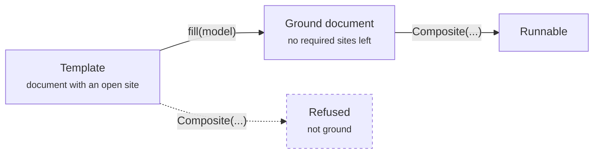

# Templates & draft processes

[Core concepts](../foundations/core-concepts.md) ends on a claim that sounds too tidy to be
true: a composite, a template, a study, and an investigation are all *the same kind of
thing* — a typed document — and they differ in structure, not in execution machinery. This
chapter is where that claim earns its keep. It is about interface-first modeling: designing
a document with the mechanism deliberately left out, and filling it in later.

There are two ways to leave a mechanism out, and they are worth keeping apart:

- A **site** is an empty *hole* — a place where a whole composite, process, or value has to
  plug in before the document can run.
- A **draft process** is a present-but-*inert* node — the interface is there, wired and
  visible, but it carries no dynamics, so it no-ops when stepped.

A site makes a document refuse to run; a draft lets it run and simply does nothing. Both let
you commit to the *shape* of a model before you commit to its *behaviour*.

## Sites, fill, and ground

The framework collapses a lot of apparent machinery into three ideas — one object, one
operation, one law:

!!! quote ""
    One object (a typed **document**), one operation (**fill** its sites), one law
    (**`is_ground`** — it runs iff no unfilled required site remains).

A **template** is just a document that still has holes. The holes are **sites**, written in
the document as `{"_type": "site", ...}`; each site records the *face* (the port interface)
a filler must present. The one operation on documents is **fill** — substitute a value or a
sub-composite into a site. And the one law is **groundness**: `Composite` refuses to build a
document with any open *required* site, because "an open site is a hole where a process
should be."



The primitives live in **bigraph-schema** — this is the layer that owns "what a document
*is*." Filling and the groundness check are real, shipped functions:

| Concept | Where it lives | What it is |
|---|---|---|
| a **site** (place-graph hole) | `bigraph_schema.schema` (`Site`), re-exported through `assembly` | a hole in the place graph a filler substitutes into |
| **`fill`** | `Core.fill(schema, state, ...)` | substitute fillers into open sites; incremental |
| **`is_ground`** | `bigraph_schema.assembly.is_ground(schema)` | true iff no sites remain and all ports are wired |

!!! note "Verified against code"
    `is_ground` is a real function in `bigraph_schema/assembly.py` ("no Sites, all ports
    wired"); `Core.fill` is a real method in `bigraph_schema/core.py`; the `Site`
    place-graph hole is a real type defined in `bigraph_schema/schema.py` and used
    throughout `assembly.py` (from which it is importable). process-bigraph's `templates.py`
    imports `fill_sites` from `bigraph_schema.assembly` and builds on all three. This is the
    machinery the design docs describe as "shipped in bigraph-schema" — the site/fill/ground
    layer is current API, not a plan.

!!! note "Legacy vocabulary"
    Older design documents call sites **slots**, and call filling them **bind** or
    **reify**. Prefer **site / fill / ground**; treat *slot / bind / reify* as synonyms when
    you meet them in older material.

### Building and filling a template

process-bigraph wraps the bigraph-schema primitives in a small template toolkit
(`process_bigraph/templates.py`) so you can read the state of a document and fill it. The
functions are thin and honest:

| Function | What it does |
|---|---|
| `open_sites(document)` | the paths of every site still open |
| `required_open_sites(document)` | the open sites with no `_default` — the ones that block a build |
| `is_ground_document(document)` | `not required_open_sites(...)` — the runnable predicate |
| `fill_template(core, template, bindings)` | fill sites; unbound sites stay open (filling is incremental) |
| `template_document(core, template, bindings)` | fill **and render** the document `Composite` consumes; raises, naming any required site left unfilled |

Here is the whole arc — a "study" template that fixes its analysis and leaves the *model* as
a hole, then fills the hole with a conforming composite so it becomes ground and runs:

```python
from process_bigraph import Composite, Step, allocate_core
from process_bigraph.templates import open_sites, is_ground_document, template_document

class ReportCard(Step):                               # a fixed downstream verdict
    config_schema = {'threshold': 'float'}
    def inputs(self):  return {'level': 'float'}
    def outputs(self): return {'verdict': 'string'}
    def update(self, state):
        return {'verdict': 'pass' if state['level'] >= self.config['threshold'] else 'fail'}

core = allocate_core()
core.register_link('ReportCard', ReportCard)
core.register_link('Grow', Grow)                      # the Grow process from the emitters chapter
MODEL_FACE = {'_type': 'link', '_inputs': {'level': 'float'}, '_outputs': {'level': 'float'}}

# analysis fixed; the model is a HOLE with a declared face
template = core.access({'study': {
    'level': 1.0, 'verdict': 'string',
    'model':  {'_type': 'site', '_sort': MODEL_FACE},
    'report': {'_type': 'step', 'address': 'local:ReportCard', 'config': {'threshold': 2.0},
               'inputs': {'level': ['level']}, 'outputs': {'verdict': ['verdict']}}}})

print(open_sites(template), is_ground_document(template))   # [('study', 'model')] False

def model(rate):                                      # any conforming composite fits the hole
    return core.access({'_type': 'process', 'address': 'local:Grow', 'config': {'rate': rate},
                        'interval': 1.0, 'inputs': {'level': ['level']}, 'outputs': {'level': ['level']}})

sim = Composite({'state': template_document(core, template, {'study/model': model(0.5)})}, core=core)
sim.run(4.0)
print(sim.state['study']['verdict'])                  # pass  (a slower model would fail)

# template_document(core, template, {}) → ValueError: not ground — required site 'study/model'
```

The last comment is the law in action: hand `template_document` an empty binding and it
raises, naming the required site you left open — the same condition `Composite` enforces,
reported before construction so you see *which* hole is empty rather than a downstream
constructor error.

!!! quote ""
    The composite is reusable across many questions; the template attaches one question by
    filling one hole. Separating them means you can re-run the science without rewriting the
    argument.

This is exactly how the agentic spine works. A **study** is a template with its model site
filled; an **investigation** is a document with one site per member study, admitted by
filling. process-bigraph even ships `investigation_document(...)`, which fills the members
you bind and *prunes* the regions you leave open — so "gating a study" is not a scheduler
deciding to skip it, it is simply a site left unfilled. Gating and template binding are the
same mechanism. See [Studies](../investigate/studies.md) and
[Investigations](../investigate/investigations.md) for that layer.

## Draft processes

A site is an empty hole. A **draft process** is the complementary idea: a node that is
*there but inert*. A `DraftProcess` declares a **contract** — its input and output ports
plus a human-readable description of the transformation it is *meant* to perform — but
carries **no `update` dynamics**. It inherits the base `Process.update` no-op, so a composite
containing a draft still builds and still runs; the draft just contributes nothing.

!!! quote ""
    A draft lets the model topology — which process connects which stores — be designed and
    reviewed *before* anyone commits to a mechanism. It never fabricates behaviour it does
    not have.

That last clause is the whole point. In a framework whose verdicts are computed from what a
run actually produced, a placeholder that quietly invented some plausible dynamics would be
a lie the evidence layer could not catch. A draft is honest by construction: stepped, it
returns `{}`, and it announces itself as unfinished.

### `@draft_process`

You define a concrete, registrable draft with the `@draft_process` decorator. It injects the
ports and contract onto a bare `DraftProcess` subclass:

```python
from process_bigraph import DraftProcess, draft_process

@draft_process(
    name="PTH secretion",
    inputs={'ca_sense': 'float'},
    outputs={'pth_out': 'float'},
    contract={'summary': 'senses serum Ca, secretes PTH',
              'senses': 'calcium', 'makes': 'PTH'})
class PTHSecretion(DraftProcess):
    pass

core.register_link('PTHSecretion', PTHSecretion)
print(PTHSecretion({}, core=core).describe())
# DRAFT — senses serum Ca, secretes PTH  ·  makes: PTH  ·  senses: calcium  ·  status: draft - no update dynamics yet
```

There is no `update` on the class — deliberately. `describe()` renders the whole contract
prefixed with `DRAFT —`, and the decorator stamps `status: "draft - no update dynamics yet"`
into the contract automatically. Because a module-scope `DraftProcess` subclass is discovered
and auto-registered by a workspace's `build_core()` (the same walk that registers every
Process and Step), a draft **shows up in the Workbench dashboard by name, with its ports and
contract, marked** <span class="pill draft">DRAFT</span> — with no extra wiring. Replace it
with a real `Process` once the mechanism is committed, and nothing else in the composite has
to change.

!!! note "Verified against code — `DraftProcess` is a shipped primitive"
    `DraftProcess` and `@draft_process` are real, exported from `process_bigraph`
    (`process_bigraph/draft_process.py`; re-exported in `__init__.py`). The decorator
    signature is `@draft_process(*, name, inputs, outputs, contract)` — all keyword-only.
    Registry tooling reads a draft *uninitialized*: it calls `inputs()`/`outputs()` on the
    class and `describe()` on a bare instance, which is why every method reads class
    attributes and needs no configured instance.

Three "blanks" are easy to confuse — keep them apart:

| Blank | State of the document | Fills it with |
|---|---|---|
| **site** | not runnable until filled (a hole) | `fill` — a value or sub-composite |
| **draft process** | runnable; the node no-ops | replacing it with a real `Process` |
| **`config` / params** | runnable; the node runs | supplying parameter values |

A site is an *empty hole*; a draft is a *present-but-inert node*; a config value fills a
node's *parameters*, not a hole and not a node.

## The compiler view

Draft processes point at something larger than a scaffolding trick. Read the ecosystem's
design notes and a picture emerges of the framework as a **compiler** — from what a biologist
*means* to what an engine can *run*.

!!! quote ""
    People describe biological systems by their meaning. Simulators need an executable
    graph. Between them sits a compiler. — *compiling-biology-to-bigraphs*

In that framing (from the conceptual corpus, `compiling-biology-to-bigraphs.pdf`, dossier
05 §4), a `DraftProcess` — a contract with roles, ports, and intent but no dynamics — is the
**source-level semantic model**: the top layer of a small, nanopass-style pipeline. Below it
sit a typed reaction-network intermediate representation, then an executable composite
(processes, ports, place graph, an emitter), then `Composite.run()`. The step that turns an
abstract mechanism into one concrete simulation is read as an **algebraic-effect handler**:
one declared effect, many handlers, so a single semantic model can be closed off into a
deterministic mass-action realization or a stochastic one — "same meaning, two executable
interpretations, agreeing where theory says they must."

The slogan that captures the discipline:

!!! quote ""
    A process-bigraph process should be *one possible realization* of a biological
    mechanism, not the definition of that mechanism. — *vivarium_semantic_layer*

!!! warning "Accuracy note — direction, not a shipped one-click feature"
    The site/fill/ground machinery and `DraftProcess` are **shipped code** (verified above).
    The full "biology → executable" compiler — an elaborator library that turns a semantic
    `kind` into elementary reactions, a handler registry that fixes how each reaction is
    simulated, ontology grounding — is a **documented direction**, explored in a working
    prototype (`littleb-pbg`) and specified in the semantic-layer RFCs, not a one-click
    feature in the current package. The load-bearing pieces you can rely on today are the
    two on this page: leave a hole (**site**) or leave a mechanism undeclared (**draft**),
    and fill it in when the science is ready. Treat the compiler itself as where the
    interface-first workflow is *heading*.

The through-line is the one this chapter opened with, now with teeth: a template is a
document with holes, a draft is a document with an inert node, and the same act — filling the
hole, supplying the mechanism — turns designed structure into executable behaviour without
ever letting the framework pretend a mechanism exists before it does.

---

**Next:** [Workspaces & the Workbench](../investigate/workspaces-and-workbench.md)
