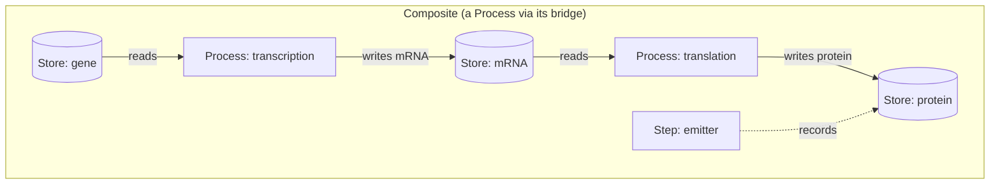

---
tags:
  - concepts
  - process
  - step
  - composite
---

# Core concepts

This chapter builds the whole framework from first principles. The vocabulary is
deliberately small: a handful of structural ideas, then a handful of temporal ones, then
the way models compose. Everything later in the guide is an application of what is here.

The formal anchors come from the **Process Bigraph** paper's core vocabulary (Table 1);
the plain-language framing comes from the *Composition Interface Protocol* primer. Where a
term has a legacy synonym, it is noted — the ecosystem is mid-migration and older
documents use different words for the same idea.

!!! info "On this page"
    **Assumes** you've read [What is Vivarium?](what-is-viva-eco.md). · **You'll learn**
    stores, edges and wires; processes vs steps; the delta-merge semantic that makes models
    compose; and how composites, templates and studies are all one kind of typed document.

## Structure: stores, edges, and wires

At its base, a Vivarium model is a **bigraph** — a structure with two orthogonal parts:
a **place graph** (what contains what) and a **link graph** (what is wired to what).

### Stores — the state

A **Store** holds a typed value: a molecule count, a concentration field, the clock. If
you think of a model as a program, stores are its **variables**. Stores nest
hierarchically — a cell store contains a cytoplasm store contains a metabolites store —
and that nesting *is* the place graph. A value's address is the **path** to it, e.g.
`['cell', 'cytoplasm', 'glucose']`.

Formally, **state** is a map from paths to values, `x : P ⇀ V`, and a **schema** is a map
from paths to types, `Σ : P ⇀ T` — "the typed organizational blueprint of the system."
The separation between schema and state is the central principle: it lets you validate a
model, reuse its structure, and reason about composition **independently of execution**.

### Edges — the functionality

An **Edge** is a unit of functionality attached to stores. Each input or output of an edge
is a **Port**. An edge never talks to another edge directly; it reads and writes **shared
stores**, and that shared wiring *is* the coupling between them.

There are exactly two kinds of edge, and the difference is **time** (see below): a
**Process** and a **Step**.

### Wires — the coupling

A **Wire** connects a port of an edge to a store by its path, `W : (process, port) → P`.
Wiring makes every coupling explicit and checkable. Where the place graph says *where*
things are, wires say *how* they are connected.

!!! note "Place graph vs link graph"
    - **Place graph** = containment = dict nesting. "Cell contains cytoplasm."
    - **Link graph** = wiring = ports connected to store paths. "Transcription reads the
      gene store and writes the mRNA store."

## Time: processes and steps

The *Composition Interface Protocol* describes structure. What it does not specify is
**time**. Process Bigraph adds a global clock and splits edges by their relationship to it.

### A **Process** — temporal
Declares an **interval** (a timestep) and an `update(state, interval)` method that advances
dynamics over a span of time — an ODE integrator, an FBA solve, a stochastic step, a
spatial update. The clock drives it.

### A **Step** — reactive
Declares **no interval**. Its `update(state)` fires when its inputs are ready — a dataflow
rule run to convergence. Steps form a DAG that settles whenever the state they depend on
changes. **Emitters, analyses, visualizations, and report cards are all Steps.**

Together, processes and steps let one simulation express both **continuous dynamics**
(processes running at regular intervals) and **discrete events** (steps firing in response
to conditions).

## The one semantic that makes it compose

Here is the single most important idea in the framework:

!!! quote ""
    Processes never mutate state directly. Each `update()` returns a typed **delta**; the
    runtime merges it into shared state through the schema's `apply` method.

A process reads the state it is wired to, computes, and **returns a change** — it does not
write anything itself. The runtime collects every process's delta and applies it through
the type's own combination rule:

- **Accumulate** — numeric types add (two processes both consuming glucose subtract their
  amounts; the pool ends up correct).
- **Set** — replace the value.
- **Merge** — dict update.

Because *how deltas combine is a property of the data type, not the process*, two
independently-written processes can write to the same store without knowing about each
other. Numerical updates, structural rewrites, and scheduling therefore all live under one
execution protocol. **This is what lets independently-written processes be wired together.**

## Types and the type system

A **type** knows how to do a few things: produce a **default** value, **serialize** and
deserialize, **check** whether a value is valid, and — crucially — **apply** a delta. These
behaviors live in `bigraph-schema`. Types compose (a `map[string, float]`, an
`array[(3|4), float]`, a `tree[float]`), carry **units**, and can declare inheritance. A
composite's wiring is therefore *checkable, not ad hoc*: the type system knows whether two
ports can legally connect.

The operational object is a **Core** — a registry of types (and of process classes) that
the engine consults. You will meet it directly in
[Schemas, types & state](../compute/schema-types-state.md).

!!! warning "Accuracy note"
    `bigraph-schema` was rewritten (v1.4.x). If you find older tutorials referring to a
    `TypeSystem` class or dict-keyed `_apply`/`_serialize` methods, that API is gone — the
    current object is `Core`, built via `allocate_core()`, with type behaviors dispatched
    as methods. The *concepts* above are stable; verify *code* against the current package.

## Composition: the composite

A **Composite** is a state-tree of typed process and step nodes wired to shared stores.
**It is the only object the engine actually runs.** Everything higher up in the framework
merely points at a composite and records what came out.

A composite is a **document**: state + processes + the port wiring between them. Crucially,
a composite is *itself a Process* — it owns an internal state-tree and scheduler and
exposes a **bridge** that maps its external ports onto internal store paths. So a composite
drops into a parent composite as a single node. This is how multiscale models are built:
**containment, not hole-filling** — big models are assembled from small ones.

## From documents to templates: sites, fill, and ground

A composite you can run is **ground** — every required slot is filled. A composite with a
**hole** in it is a **template**.

- A **site** is a place-graph hole: a slot where a whole composite, process, or value plugs
  in. (This is Milner's bigraph *site*.) A composite **refuses to run** while any required
  site is open — "a hole is where a process should be."
- The one operation on documents is **fill**: substitute a value or a sub-composite into a
  site.
- The one law is **groundness** (`is_ground`): *a document runs iff it has no unfilled
  required sites.*

This collapses a lot of apparent machinery into one idea:

!!! quote ""
    One object (a typed document), one operation (**fill** its sites), one law
    (**`is_ground`**). A composite, a template, a study, and an investigation are all the
    same kind of thing — they differ in structure, not in execution machinery.

!!! note "Legacy vocabulary"
    Older design documents call sites **slots**, and call filling them **bind** or
    **reify**. Prefer **site / fill / ground**; treat *slot / bind / reify* as synonyms
    when you meet them.

### Draft processes

A **draft process** is a template idea applied to a single process. A `DraftProcess`
declares a **contract** — its input and output ports plus a human-readable description of
the transformation it is *meant* to perform — but carries **no dynamics**. Stepped, it
stays inert and never fabricates behavior; it appears in the dashboard marked
DRAFT. This lets you design an interface first and supply
the mechanism later. See [Templates & draft processes](../compute/templates-and-draft-processes.md).

## The knowledge concepts

Above the composite sit the concepts of the agentic spine. They are all **metadata that
references a composite by a dotted id and records what came out** — none of them is the
thing that runs.

| Concept | One-line definition |
|---|---|
| **Composite** | The runnable object — the only thing the engine executes. |
| **Study** | The reason you run it: one question, one emit-contract, one pass/fail bar wrapped around a composite. |
| **Investigation** | The argument several studies build together: a gated DAG under one research question. |
| **Run** | One execution of a composite; produces a run store of trajectories. |
| **Emitter** | A Step that records wired state each tick into a durable sink. |
| **Analysis / Visualization** | Steps that read a run's normalized results and write artifacts (figures, tables). |
| **Behavior test** | A machine-checkable spec: how to *measure* a result and what *passing* means. |
| **Report card** | A Step that reads a run and produces pass/fail outcomes keyed by test — the raw evidence. |
| **Acceptance band** | The tolerance or direction a test accepts (e.g. "within 2%"), ideally cited to literature. |
| **Finding** | A summary of what was seen, floored by a lifecycle so an unproven claim can't look settled. |
| **Verdict** | The study's computed conclusion state (passed / failed / needs_calibration / blocked). |
| **Provenance** | Every write is a git commit; verdict, readiness, and debts are diff-able. |

!!! quote "The sentence to remember"
    A **Composite** is the runnable object; a **Study** is the reason you run it; an
    **Investigation** is the argument several studies build together.

Each of these gets a full chapter in [Investigate](../investigate/studies.md).

---

**Next:** [The stack](the-stack.md) — how the four packages layer and depend on each other.
