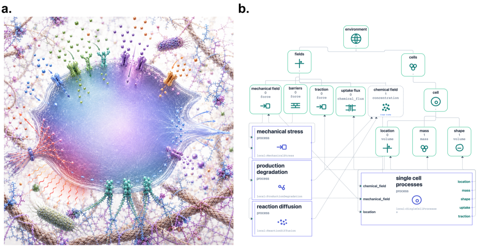
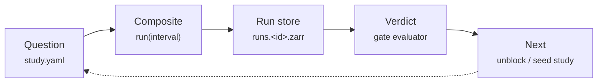

---
tags:
  - getting-started
  - concepts
---

# What is Vivarium?

Vivarium is a framework for **composing multiscale biological models** and for turning
their runs into **auditable scientific evidence**. This chapter gives you the mental
model everything else in the guide builds on.

!!! info "On this page"
    **Assumes** no prerequisites — start here. · **You'll learn** why the rebuild tax
    exists, the two spines and the discovery loop between them, and what makes a study's
    conclusion trustworthy.

## The problem: the rebuild tax

Biological systems are modeled with wildly different formalisms. Gene expression is
naturally a set of ODEs; metabolism is a flux-balance (FBA) linear program; a morphogen
gradient is a PDE; a growing colony is an agent-based model. Each of these is written in
its own tool, with its own assumptions, units, and time scales.

When you want a model that spans scales — say, a whole cell whose metabolism feeds its
gene expression, inside an environment with diffusing nutrients — you normally pay the
**rebuild tax**: you reinterpret the literature, reconstruct the model structure, and
re-implement everything in one monolithic simulator. Every new question means editing the
monolith, and every edit risks breaking the parts that already worked.

Vivarium removes that tax by making models **compose**. Independently-written simulators
are wrapped as typed **Processes** and wired together through explicit, checkable
interfaces. A whole cell becomes a single named composite you assemble from parts; adding
or swapping a subsystem is *wiring*, not forking. It's a shift in stance: you work less as a
modeler rebuilding biology from scratch than as a *meta-modeler*, wiring existing models
together and letting the biological meaning emerge from how they are coupled and
orchestrated across scales.

<figure class="viva-figure">

<figcaption>A cell modeled in its environment. <strong>Left:</strong> the living system.
<strong>Right:</strong> its process bigraph — an <code>environment</code> of typed fields
and a <code>cell</code> of processes (mechanical stress, reaction–diffusion, single-cell
dynamics) wired to shared stores. Adding or swapping a subsystem is <em>wiring</em>, not forking.</figcaption>
</figure>

!!! quote "The guiding principle"
    New science is a **new study**, not a patch to the model.

## The two spines

Vivarium is built as **two spines wired into one discovery loop**.

### :material-cog: The computational spine — *what runs*
A compositional runtime built on Milner's bigraphs. State lives in typed **Stores**;
dynamics live in **Processes** (temporal) and **Steps** (reactive) wired to those stores;
whole simulations nest as **Composites**. Updates are **deltas** merged by the type
system. Packages: `process-bigraph`, `bigraph-schema`, `viva-emitters`.

### :material-brain: The agentic spine — *what reasons*
A knowledge layer that frames each model run as a **Study** inside an **Investigation**.
Studies form a DAG through prerequisite gates; a code-computed evaluator rolls runs up
into a **verdict**, a **readiness** score, and open **epistemic debts**. Packages:
`viva-superpowers`, the study spine, the `/viva-*` skills.

A single simulation answers nothing on its own. The computational spine makes a model
*run*; the agentic spine gives that run a *scientific shape* — a question it answers, a
pass/fail bar it must clear, and a place in a larger argument.

!!! quote ""
    Neither spine is the engine — the engine is the closed loop between them, and the
    **Workbench** is where the loop turns.

## The discovery loop

The two spines meet in a loop that runs at every scale of the work:

A **question** is written as a study; it points at a **composite** and runs it; the run
emits a **run store** of trajectories; a code-computed **verdict** grades the run against
the study's tests; and the verdict tells you what to ask **next**. AI agents can ride this
loop at every hop — proposing studies, running composites, hardening findings, reading
verdicts to choose what to ask next — while every step stays legible to a human on the
study page.

## What makes it trustworthy

Two design commitments run through the whole framework, and they are worth internalizing
before anything else:

1. **A study's conclusion is computed from its evidence, not asserted.** You do not write
   `status: pass` by hand. The verdict is derived from the latest run's measured outcomes.
   This is what stops a study from *claiming* a result it never produced.

2. **The tool is AI-free; the AI is a swappable plugin.** The Workbench server, its data,
   and its evidence rendering contain no AI. All AI capability is packaged as the
   `viva-superpowers` Claude Code plugin — a set of `/viva-*` skills that call the
   Workbench's HTTP API. This keeps the tool auditable and the AI replaceable.

Because a study is **typed data**, hardening it — filling gaps, citing evidence, tightening
a claim — is a transformation an agent can apply and a human can verify, not a matter of
taste.

## Who this guide is for

- **Modelers** who want to build a multiscale model without paying the rebuild tax →
  start with [Core concepts](core-concepts.md), then [Build & run models](../compute/processes-and-steps.md).
- **Scientists** who want reproducible, inspectable computational evidence → head to
  [Studies](../investigate/studies.md) and [Investigations](../investigate/investigations.md).
- **Tool builders and agent authors** driving the platform programmatically → see
  [Working with AI agents](../investigate/working-with-agents.md) and the
  [HTTP API reference](../reference/http-api.md).

## The foundational paper

The framework is described in **Agmon & Spangler, *Process bigraphs and the architecture
of compositional systems biology*** (arXiv:2512.23754), which introduces **Vivarium 2.0**
as the open-source implementation across three libraries — `bigraph-schema`,
`process-bigraph`, and `bigraph-viz` — demonstrated with **Spatio-Flux**, a library of
microbial-ecosystem simulations combining kinetic equations, dynamic FBA, and spatial
processes. Its move is to take the architectural ideas that once lived inside the original
Vivarium software and generalize them into a shared specification — of process interfaces,
hierarchies, composition patterns, and orchestration — so models can be understood, reused,
and built on rather than rebuilt.

---

**Next:** [Core concepts](core-concepts.md) — the vocabulary, from first principles.
