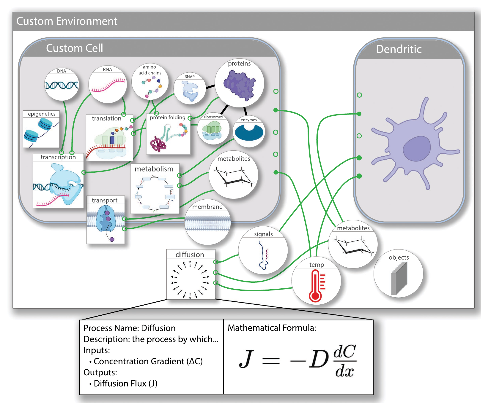
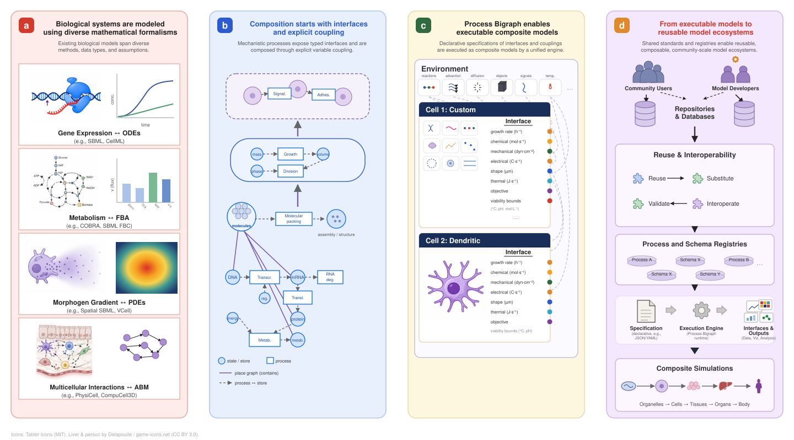

---
hide:
  - navigation
  - toc
---

# The Vivarium Users Guide

Simulation you can compose. Reasoning you can audit.

[Start here](start-here.md){ .md-button .md-button--primary }
[Quick start](quickstart.md){ .md-button }
[What is Vivarium?](foundations/what-is-viva-eco.md){ .md-button }

Vivarium is a framework for building **multiscale biological models** by composing
independently-written simulators into one executable whole — and for turning the runs
into **auditable scientific evidence**. It is built as two spines wired into a single
discovery loop:

### :material-cog: The computational spine
*What runs.* Typed **Stores** hold state; **Processes** and **Steps** wired to them carry
the dynamics; whole simulations nest as **Composites**. Updates are deltas merged by the
type system.

### :material-brain: The agentic spine
*What reasons.* Each run is a **Study** inside an **Investigation**. Studies form a gated
DAG; a code-computed evaluator rolls runs up into a **verdict**, a readiness score, and
open epistemic debts.

!!! quote ""
    Neither spine is the engine — the engine is the closed loop between them, and the
    **Workbench** is where the loop turns.

## The four packages

Each layer imports the ones below it and never the reverse. Click through to any layer.

<a class="stacknav-layer part-reference" href="investigate/working-with-agents/">
viva-superpowersthe /viva-* skills
The Claude Code skills that author and run everything. All AI lives here, so the tool below stays auditable.
</a>
<a class="stacknav-layer part-investigate" href="investigate/">
vivarium-workbenchthe dashboard server
The AI-free server: investigations, studies, runs, analyses, report cards — every change committed to git.
</a>
<a class="stacknav-layer part-build" href="compute/composites-and-wiring/">
process-bigraphthe engine
The composite / process / step / template primitives, the tick scheduler, and the emitters that record state.
</a>
<a class="stacknav-layer part-build" href="compute/schema-types-state/">
bigraph-schemathe type system
The types beneath every store. <code>apply</code> is the one law that merges deltas, so independent processes compose.
</a>

A Composite is the runnable object; a Study is the reason you run it;
an Investigation is the argument several studies build together.

## How it all fits together

Read the map bottom-up and it's a simulation; read it top-down and it's an argument.
Every box links to the chapter that covers it.

<svg viewBox="0 0 900 560" role="img" aria-label="Concept map of the Vivarium object model" xmlns="http://www.w3.org/2000/svg">
<defs><marker id="cmarrow" viewBox="0 0 10 10" refX="9" refY="5" markerWidth="7" markerHeight="7" orient="auto-start-reverse"><path d="M0,0 L10,5 L0,10 z" fill="#94a3b8"/></marker></defs>
<path class="cedge" d="M245,114 L245,170" marker-end="url(#cmarrow)"/>
<path class="cedge" d="M245,224 L245,280" marker-end="url(#cmarrow)"/>
<path class="cedge" d="M245,334 L245,390" marker-end="url(#cmarrow)"/>
<path class="cedge" d="M245,444 L245,480" marker-end="url(#cmarrow)"/>
<path class="cedge" d="M655,114 L655,190" marker-end="url(#cmarrow)"/>
<path class="cedge" d="M655,244 L655,320" marker-end="url(#cmarrow)"/>
<path class="cedge" d="M655,374 L655,450" marker-end="url(#cmarrow)"/>
<path class="cedge" d="M560,217 C 470,245 430,392 345,417" marker-end="url(#cmarrow)"/>
<text class="cedge-label" x="252" y="146">types</text>
<text class="cedge-label" x="252" y="256">read / write</text>
<text class="cedge-label" x="252" y="366">wired into</text>
<text class="cedge-label" x="252" y="466">emits</text>
<text class="cedge-label" x="662" y="156">groups</text>
<text class="cedge-label" x="662" y="286">grades</text>
<text class="cedge-label" x="662" y="416">computes</text>
<text class="cedge-label" x="425" y="300">runs</text>
<a href="compute/schema-types-state/"><g class="cnode part-build" transform="translate(150,60)"><rect width="190" height="54" rx="11"/><text class="clabel" x="95" y="25" text-anchor="middle" font-size="15">Schema</text><text class="csub" x="95" y="42" text-anchor="middle" font-size="10.5">types every store</text></g></a>
<a href="foundations/core-concepts/"><g class="cnode part-build" transform="translate(150,170)"><rect width="190" height="54" rx="11"/><text class="clabel" x="95" y="25" text-anchor="middle" font-size="15">Store</text><text class="csub" x="95" y="42" text-anchor="middle" font-size="10.5">typed state</text></g></a>
<a href="compute/processes-and-steps/"><g class="cnode part-build" transform="translate(150,280)"><rect width="190" height="54" rx="11"/><text class="clabel" x="95" y="25" text-anchor="middle" font-size="15">Process · Step</text><text class="csub" x="95" y="42" text-anchor="middle" font-size="10.5">the dynamics</text></g></a>
<a href="compute/composites-and-wiring/"><g class="cnode part-build" transform="translate(150,390)"><rect width="190" height="54" rx="11"/><text class="clabel" x="95" y="25" text-anchor="middle" font-size="15">Composite</text><text class="csub" x="95" y="42" text-anchor="middle" font-size="10.5">the runnable object</text></g></a>
<a href="compute/emitters/"><g class="cnode part-build" transform="translate(150,480)"><rect width="190" height="54" rx="11"/><text class="clabel" x="95" y="25" text-anchor="middle" font-size="15">Emitter</text><text class="csub" x="95" y="42" text-anchor="middle" font-size="10.5">records the run</text></g></a>
<a href="investigate/investigations/"><g class="cnode part-investigate" transform="translate(560,60)"><rect width="190" height="54" rx="11"/><text class="clabel" x="95" y="25" text-anchor="middle" font-size="15">Investigation</text><text class="csub" x="95" y="42" text-anchor="middle" font-size="10.5">the argument</text></g></a>
<a href="investigate/studies/"><g class="cnode part-investigate" transform="translate(560,190)"><rect width="190" height="54" rx="11"/><text class="clabel" x="95" y="25" text-anchor="middle" font-size="15">Study</text><text class="csub" x="95" y="42" text-anchor="middle" font-size="10.5">the question</text></g></a>
<a href="investigate/analyses-visualizations-report-cards/"><g class="cnode part-investigate" transform="translate(560,320)"><rect width="190" height="54" rx="11"/><text class="clabel" x="95" y="25" text-anchor="middle" font-size="15">Report card</text><text class="csub" x="95" y="42" text-anchor="middle" font-size="10.5">grades the tests</text></g></a>
<a href="investigate/rigor-and-evidence/"><g class="cnode part-investigate" transform="translate(560,450)"><rect width="190" height="54" rx="11"/><text class="clabel" x="95" y="25" text-anchor="middle" font-size="15">Verdict</text><text class="csub" x="95" y="42" text-anchor="middle" font-size="10.5">computed, not asserted</text></g></a>
</svg>

## Choose a path

### :material-map-marker-path: New here?
Start with **[What is Vivarium?](foundations/what-is-viva-eco.md)** for the mental model,
then **[Core concepts](foundations/core-concepts.md)** for the vocabulary.

### :material-hammer-wrench: Build a model
Go to **[Processes & Steps](compute/processes-and-steps.md)** and
**[Composites & wiring](compute/composites-and-wiring.md)** to write and run your first
composite.

### :material-flask: Do science
Head to **[Studies](investigate/studies.md)** and
**[Investigations](investigate/investigations.md)** to turn runs into gated, verdict-bearing
evidence.

### :material-book-open-variant: Look something up
The **[Reference](reference/index.md)** section has the skill catalog, HTTP API, schemas,
install/deploy, and a full worked example.

See the **[Start here](start-here.md)** guide for full step-by-step learning paths.

## What a composed model looks like

<figure class="viva-figure">

<figcaption>A composed multiscale model: two cells inside a shared environment, each a
composite of processes (transcription, translation, metabolism, transport…) wired to
typed stores — and, below, the <strong>Process Card</strong> that documents one process's
interface. Composition is wiring, not forking.</figcaption>
</figure>

<figure class="viva-figure">

<figcaption>The Process Bigraph framework: from diverse formalisms (ODEs, FBA, PDEs, ABMs)
to typed interfaces and explicit coupling, to executable composites, to reusable model
ecosystems.</figcaption>
</figure>

---

<small>The Vivarium framework is described in Agmon &amp; Spangler, *Process bigraphs and
the architecture of compositional systems biology* (arXiv:2512.23754). Source packages
live at [github.com/vivarium-collective](https://github.com/vivarium-collective).</small>
