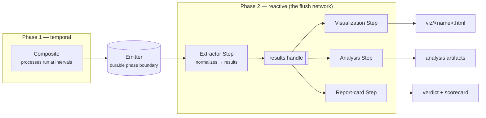

---
tags:
  - visualization
  - report-card
  - study
---

# Analyses, visualizations & report cards

A simulation produces a wall of numbers. This chapter is about the machinery that
turns that wall into something a person — or an agent — can read and trust: the
**figures**, the **derived tables**, and the **graded scorecards** a study emits
after it runs. All three are built from the same primitive you already met in
[Core concepts](../foundations/core-concepts.md): a **Step** — a non-temporal edge
that fires when its inputs are ready.

<p class="viva-pull">Emitters, analyses, visualizations, and report cards are all
Steps. The clock never drives them; the arrival of a completed run does.</p>

!!! info "On this page"
    **Assumes** [Studies](studies.md), [Composites & wiring](../compute/composites-and-wiring.md). · **You'll learn** the two-phase study, why emitters, analyses, visualizations, and report cards are all Steps, and how the flush network fires.

## The two-phase study

A [study](studies.md) is not one simulation and then, separately, some plotting
code you run by hand. It is a single **two-phase process bigraph**, and the seam
between the phases is the most important idea in this chapter.



- **Phase 1 is temporal.** The composite's Processes advance the state tree at
  their declared intervals — an ODE integrator, an FBA solve, a stochastic step.
  This is the science running.
- **The emitter is the durable phase boundary.** As the run proceeds, an
  [Emitter](../compute/emitters.md) Step records the wired state each tick into a
  durable sink — SQLite `runs.db`, a Parquet hive, or a Zarr store. Everything
  before the emitter is ephemeral in-memory state; everything after it reads from
  disk. The run can finish, the server can restart, and the evidence is still
  there.
- **Phase 2 is reactive — the flush network.** Once the emitter has written, an
  **extractor Step** normalizes that emitter output into a single `results`
  handle, and a DAG of downstream Steps reads that handle and writes artifacts:
  visualizations write HTML, analyses write figures and tables, report cards write
  graded verdicts.

Because Phase 2 is a Step DAG, it obeys the one law of Steps: it settles to
convergence whenever the state it depends on changes. Re-run the study and the
whole flush network re-fires against the new run. Nothing in Phase 2 is a script
you remember to launch.

!!! info "Design vs shipped"
    The clean "extractor Step → single typed `results` handle → uniform artifact
    DAG" picture is the framework-unification target (the two-phase **Study
    composite**, Layer 1). Much of it is real today: runs land in a durable
    emitter store, the workbench renders visualizations and runs analyses over
    that store after each run (`lib/composite_flush.py`, the post-run hooks), and
    data-driven report cards read run records through a `ResultsStep` handle that
    exposes a DuckDB view literally named `results`. Where the shipped path still
    uses per-artifact rendering hooks rather than one first-class extractor node,
    this guide flags it. The *mental model* — durable boundary, then a reactive
    network of artifact Steps — is stable; verify exact wiring against the current
    code.

## Authoring a visualization

A visualization is a **Step that emits HTML**. You do not have to write a class by
hand — the `/viva-viz` skill generates one from a natural-language description into
your workspace package. What it writes is a single decorated function.

```python
from process_bigraph.visualization import as_visualization

@as_visualization(
    inputs={'dnaa_atp_fraction': 'list[float]', 'time': 'list[float]'},
    name='DnaATrajectory',
    demo={'dnaa_atp_fraction': [0.31, 0.42, 0.28], 'time': [0.0, 1.0, 2.0]},
)
def update_dna_a_trajectory(state):
    # build an interactive Plotly figure from the wired inputs …
    return {'html': fig.to_html(full_html=False)}
```

The pieces that matter:

| Element | Rule |
|---|---|
| Function name | must start `update_` — the decorator turns it into a Step class |
| `inputs=` | bigraph-schema **type strings** (`'float'`, `'list[float]'`, `'list[list[float]]'`, `'string'`) — this is the wire contract |
| `name=` | the CamelCase class the dashboard surfaces; its canonical address is `local:<ClassName>` |
| `demo=` | realistic synthetic state so the dashboard can render a preview before any run exists |
| Return | a dict with an `'html'` key |

`@as_visualization` is one of three function-to-class decorators
(`as_step`, `as_process`, `as_visualization`) provided by `process_bigraph`; the
decorator stamps `__pb_kind__` / `__pb_aliases__` metadata so the class surfaces
cleanly. You never touch `__init__.py` — discovery walks the package and
auto-registers every `Step` subclass (see [Composites & wiring](../compute/composites-and-wiring.md)).

!!! note "Decorator vs subclass — a real internal tension"
    `/viva-viz` emits the `@as_visualization` **decorated-function** form. The
    `visualizations` convention doc, however, prefers subclassing
    `Visualization` directly (a real `Step` with an `html` output port, wireable
    into composites) and marks the decorator as legacy. Both work and both are in
    the codebase; v2ecoli uses subclasses. Treat them as two spellings of one
    idea — an HTML-emitting Step — and expect the tooling to converge.

!!! quote "The bar is deliberately high"
    From the `/viva-viz` skill: *"A bare line of one observable vs time almost
    never clears that bar."* Push for interactive Plotly — hover, toggleable
    legend, sliders — and let the form fit the question: phase portraits, Sankey,
    heatmap, violin, sunburst. Propose the figure the data deserves; don't just
    fulfill a request for a line chart.

### Three render paths

How a visualization gets its data is the top cause of "my viz renders empty."
There are three disjoint paths:

| Path | Inputs | Use when |
|---|---|---|
| **A — inline composite Step** | wired ports, per tick | you want a live figure that maintains its own history during the run |
| **B — auto-render from the run store** | a typed wire dispatched from `runs.db` | the common default: `'float'`→last scalar, `'list[float]'`→full series, `'list[list[float]]'`→list-of-runs |
| **C — direct store read** | empty `inputs()`, you open the store yourself | nested coordinate arrays the typed wire would truncate (e.g. 3D structural viewers) |

## Post-run analyses and the Analysis tab

An **analysis** is the sibling of a visualization with one load-bearing
difference: it **derives an artifact but renders no verdict**. An `AnalysisStep`
produces a PNG, JSON, CSV, or Markdown output and surfaces under **Evidence ›
Analyses**; a curated figure surfaces under **Evidence › Visualizations**. Keeping
the two apart is what stops an analysis from quietly implying a pass/fail it never
computed.

After a study run completes, the workbench automatically runs every Analysis Step
declared in the study's `analyses:` list over the run's emitter output, mirroring
how the `visualizations:` list triggers HTML rendering. Each entry names a
registered analysis class plus optional `params`; outputs land under the run's
directory and their paths come back in the run response. The post-run analysis
hook reads the **Parquet** emitter output, so a SQLite-only run skips analyses —
a real gotcha worth remembering.

!!! warning "Two things share the name 'Analysis tab'"
    The rail's **Analyses** page is a gallery of *saved, special interactive
    viewers* (embedded 3D structural scenes, a PTools launcher) — not the catalog
    of every analysis class. The class catalog lives under **Registry → Discovered
    → Visualizations / Analyses**. The docs and the shipped rail labels have
    drifted here; trust the running UI.

## Runs and the run store

Not every question needs authored code. Every run in the workspace is catalogued
on the **Runs** rail page — one normalized index that unifies runs across emitter
backends (SQLite `runs.db` and Zarr `XArrayEmitter` stores), so an
externally-produced run appears there once it is registered. From a run you open
its per-study **Results** view, which reads the emitter store — scalar, vector,
and bulk observables — without your writing any code.

!!! warning "Accuracy note — the standalone Data Explorer was removed"
    Earlier builds shipped a no-code **Data Explorer** panel with four
    whole-cell-specific views (Timeseries, run-vs-run Scatter, a Voronoi
    Allocation treemap, and an Escher Flux map keyed to the *e. coli core* map).
    It was removed in vivarium-workbench PR #912 (2026-08-20) as too
    domain-specific for a general workbench — the `/api/explorer/*` routes and
    the standalone page are gone, and the per-run "view run" button now opens
    the study Results view instead. The *generic* run-data readers it was built
    on (`lib/explorer_data.py` — series / observables / vector / flux over
    parquet / zarr / sqlite) survive and back the Results view and default
    visualizations. The workbench's own `docs/data-explorer.md` still describes
    the removed panel; trust the code at HEAD.

## Report cards

A **report card** is a Step that reads a completed run and produces **pass/fail
outcomes keyed by test**, rendered as a category scorecard. It is the point in the
pipeline where evidence becomes a verdict — and the whole design turns on one
rule.

!!! quote ""
    A study's conclusion is **computed from its evidence, not asserted.** You do
    not write `status: pass`. The verdict is derived from the latest run's measured
    outcomes — which is what stops a study from *claiming* a result it never
    produced.

Two things drive that derivation, and neither is a human typing a verdict:

- **Auto-evaluation on run completion.** When a run finishes, the completion path
  fills that run's `runs[].outcomes` with normalized PASS / FAIL / PARTIAL / SKIP
  verdicts — but only for tests with no human-authored verdict, so it never
  clobbers an expert's call.
- **On-demand grading.** A fast "Run tests" path (`POST /api/study-grade`) grades
  the declared behavior tests against the latest completed run without
  re-simulating, and refreshes the card.

The compiled card is written to `<study>/viz/report_card/<card>.html` with a
structured verdict at `<card>.verdict.json`. That is the *same* artifact the live
**Tests tab** shows and the published static report reuses — so a reviewer reading
the offline bundle sees exactly the report cards a reviewer sees in the workbench.

### The category scorecard

A report card groups its axes by **category** — for example Physiology,
Composition, Ribosomes, Exchange fluxes, and Gene expression — and renders each
axis as an *axis / value / verdict* row. Those category names are data, not a
code-enforced schema: the renderer groups by whatever category slug the axes
carry, so a workspace picks its own. Verdicts, by contrast, normalize to a fixed
four-value vocabulary (with pass/warn/fail/skip aliased in):

| Verdict | Glyph | Meaning |
|---|---|---|
| `within_tol` | ✓ | measured value is within the acceptance band |
| `drift` | ≈ | partial / warned — moving, not yet failing |
| `mismatch` | ✗ | outside the band |
| `ungraded` | – | no run outcome yet |

<div class="viva-card" markdown>

**Physiology**

| Axis | Value | Verdict |
|---|---|---|
| Doubling time | 44 min | <span class="pill pass">✓</span> within tolerance |
| Growth rate (μ) | 0.94 h⁻¹ | <span class="pill pass">✓</span> within tolerance |
| Cell mass at division | 1.06× ref | <span class="pill fail">✗</span> above band |

**Composition**

| Axis | Value | Verdict |
|---|---|---|
| Protein mass fraction | 0.55 | <span class="pill pass">✓</span> within tolerance |
| RNA/protein ratio | 0.41 | <span class="pill fail">✗</span> below band |

</div>

<small>Illustrative only — the numbers, axes, and ✓/✗ verdicts on a real card are
computed from a run's outcomes against cited acceptance bands, never hand-set.</small>

Every ✓/✗ traces back to a **behavior test**: a machine-checkable spec that names
*how to measure* a result from the run and *what passing means* (an acceptance
band, ideally cited to literature). The measurement, the band, and the verdict are
one declaration that drives both execution and the rendered pill — which is why
the card cannot lie about what happened. The grammar of those tests, the acceptance
bands behind the glyphs, and how verdicts roll up into a study-level and
investigation-level judgment are the subject of
[Rigor & the evidence engine](rigor-and-evidence.md).

## The published-report aesthetic

The end product a reader receives is a **self-contained, interactive, single-file
HTML bundle** — the whole investigation, its verdict DAG, its findings, and its
embedded interactive figures in one file that opens with no server. Because the
static bundle and the live dashboard render from the *same* declared evidence
(figures, report cards, verdicts), the published report and the working session
look identical. That is not cosmetic: it is the guarantee that what you send a
reviewer is exactly what you graded.

These reports are what [agents](working-with-agents.md) produce and what the
`/viva-report` skill regenerates — deterministically, from the fields the science
wrote, with no AI in the rendering path.

---

**Next:** [Investigations](investigations.md)
