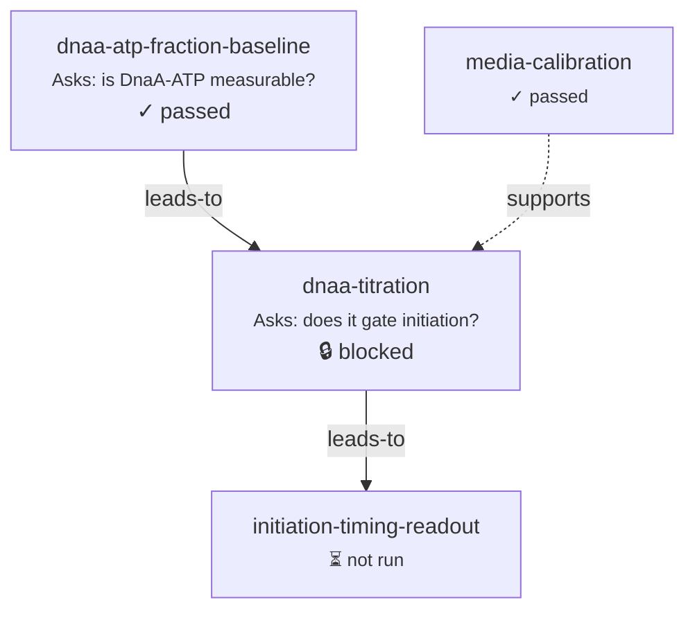

# Investigations

A single [study](studies.md) answers one question. An **investigation** is the
argument several studies build together — a named collection of studies under one
research question, wired into a gated DAG that accumulates into a defensible
claim.

<p class="viva-pull">A Composite is the runnable object; a Study is the reason you
run it; an Investigation is the argument several studies build together.</p>

Read the collection top-down and it's an argument; read it bottom-up and it's a
pile of simulations. The investigation is the layer that makes the difference —
the place where a dozen questions become evidence the field can re-run.

## Investigation ≡ branch ≡ worktree

An investigation is not just a folder of studies. It is a **1:1:1 identity**: the
slug is also a git branch name and a git worktree directory.

```
investigations/<slug>/investigation.yaml   # the collection + its narrative spine
investigations/<slug>/studies/<slug>/       # member studies, nested
investigations/<slug>/reports/              # the rendered per-investigation report
```

The `/viva-investigation` skill makes this concrete:

- **`new`** writes `investigation.yaml`, creates the branch, and commits — no push.
- **`open`** materializes a **worktree** at `<ws>/.pbg/worktrees/<slug>/` with its
  own dashboard server (its own `.pbg/composite-runs.db`, its own ports).

This is why parallel agents never trample each other: one investigation, one
branch, one worktree, one server. An investigation is the unit of a branch and a
draft PR — the natural boundary at which a line of work is proposed, reviewed, and
merged. (Merges are always a human call; the tooling never auto-merges.)

!!! note "Reproducibility follows the branch"
    Because an investigation *is* a branch, its history is its audit trail. Every
    workbench write is a git commit in the worktree, so the verdict, the readiness
    score, and the open debts are all diff-able. Checkout is archive plus current
    state.

## The `investigation.yaml` narrative spine

`investigation.yaml` carries `schema_version: 1` (minimal) or `2` (the current
narrative spine). The minimal form is the skeleton every investigation has:

```yaml
schema_version: 1
name: dnaa-replication-timing
title: "DnaA controls replication initiation timing"
status: in-progress
question: "Does the DnaA-ATP fraction gate replication initiation in the model?"
hypothesis: "Initiation fires when DnaA-ATP crosses a threshold."
studies:
  - dnaa-atp-fraction-baseline
  - dnaa-titration
  - initiation-timing-readout
acceptance_criteria:
  - {study: dnaa-titration, behavior: atp-fraction-in-range}
```

The `studies:` list is the membership (the loader also accepts `members:`).
`acceptance_criteria` are `{study, behavior}` pairs that link an
investigation-level criterion to a member study's named behavior test — the thread
that later lets the report show which criteria are actually covered by evidence.

Schema v2 adds a **nine-section spine** that a report renders automatically:

| Section | What it holds |
|---|---|
| `executive` | the state-first opening: `what_is_this`, `verdict`, `verdict_status`, `verdict_detail`, `decisions_needed[]` |
| `scientific_argument` | the reasoning chain the studies build |
| `biological_story` | the mechanism in prose |
| `lead` · `at_a_glance` | the owner; `[{study, role}]` one-line member roles |
| `how_to_read` · `glossary` | reader orientation |
| `guidelines` | investigation-wide rules |
| `inputs` | owned datasets, references, expert docs |

`verdict_status` is a small enum — `planning · in-progress · passed · complete ·
blocked · failed` — and, like everything else that looks like a conclusion, it is
governed by the derive-on-read discipline: authored intent and computed evidence
live in parallel fields so the machine never silently overwrites the human.

## Prerequisite gates and the computed DAG

An investigation stores **no edges**. The dependency DAG is **computed at render
time** from each member study's `pipeline_gate.prerequisites`. A prerequisite is a
bare slug or a small record:

```yaml
# in a member study.yaml
pipeline_gate:
  prerequisites:
    - {study: dnaa-atp-fraction-baseline, condition: tests-passed, relation: leads-to}
    - {study: media-calibration, condition: ran, relation: supports}
```

The `relation` carries **discourse semantics** — it says what *kind* of argumentative
link the edge is, and the graph renders it accordingly:

| Relation | Edge | Reading |
|---|---|---|
| `leads-to` | solid | this result sets up the next question |
| `supports` | solid | this result is evidence for another |
| `regulatory` | dashed | a modulating dependency |
| `refutes` | dashed | this result argues against another |

(The `/viva-study` convention adds a `refines` relation — a finer-grained
realization — also drawn dashed.) Each node in the rendered graph reads as an
**Ask** (its `question`) → **Finds** (its `claim` or top finding) → a
**Confidence** badge, so the whole investigation is legible as an argument at a
glance.



A member whose prerequisite has not passed renders **🔒 blocked** — and here is
the subtle part.

## Investigation-as-composite

Since August 2026 (vivarium-workbench PR #715, merged 2026-08-03 on `main`), an
investigation is not merely *described* by a DAG — it is **compiled into a
process-bigraph composite**. Each member study becomes a **`StudyStep`** node — a
real `process_bigraph.Step` wrapping that study — and each
`pipeline_gate.prerequisites` edge becomes **store wiring**: a prerequisite is
expressed as an input wire, so the engine's own scheduler orders the StudySteps by
data dependency. There is no separate gate evaluator; gating *is* process-bigraph's
ordinary producer/consumer triggering.

This reframes what a gate means:

!!! quote ""
    Gating a study is **not** "deciding not to run it." An investigation is an
    investigation *template* — one open site per member. Admitting a member fills
    its site; a member whose prerequisite is unmet is left **open and pruned** at
    compile time. No scheduler ever decides "don't run this node" — the node
    simply isn't in the ground document.

That is the same **one object / one operation / one law** collapse from
[the stack](../foundations/the-stack.md): a study is a template with its model site
filled; an investigation is a template with one site per study, filled by
membership; gating and template-binding are the same mechanism. Running "one study"
or "continue from here without rerunning the expensive upstream" is then just
`trigger(document, target)` doing pull-or-compute over the results sites — an
already-satisfied prerequisite is read from its content-addressed cache rather than
recomputed.

!!! warning "Accuracy note — two run paths coexist"
    Investigation-as-composite has shipped, but it runs alongside an older
    orchestrator. On that older path, the study-to-study DAG is **advisory**: the
    workbench computes `blocked` / `blocked_by` for the UI, but no run endpoint
    enforces study-to-study gating — the only runtime gate there is a study's own
    `conditions.model_settings` marked `gate: required-before-run` with an unset
    value. The compile-and-prune semantics above are the investigation-composite
    path (`build_investigation_composite`, `StudyStep`, `templates.trigger`).
    Which enforcement you get depends on how the investigation is run; verify
    against the current code before relying on a gate to *block* rather than merely
    *flag*.

## The roll-up

The payoff of grouping studies is that the investigation computes a summary across
all of them — none of it hand-written:

<div class="viva-grid" markdown>

<div class="viva-card" markdown>
### :material-gavel: Verdict
The rolled-up conclusion state — computed from members' outcomes, not asserted.
`roll_up_acceptance` scores the investigation's `acceptance_criteria` against each
member's behavior outcomes: any failing criterion → `failing`, else any still
running → `in-progress`, else any caveat → `passing-with-caveats`, else `passing`.
It writes only `executive.computed_verdict_status`; the parallel authored
`verdict_status` is never overwritten. (A single study rolls up its *own* tests
separately, via `roll_up_verdict` → passed / failed / needs-calibration / blocked.)
</div>

<div class="viva-card" markdown>
### :material-progress-check: Readiness
A **count of open gaps** — the "6 gaps" style signal from the report linter,
telling you exactly which fields are missing or under-supported *before* the
verdict is trustworthy. A missing field is itself the feedback.
</div>

<div class="viva-card" markdown>
### :material-alert-circle-outline: Open debts
The open epistemic debts across members — the questions owed, the
`decisions_needed`, the unresolved feedback. Surfaced so an unproven claim can't
masquerade as settled.
</div>

</div>

Two roll-up behaviors are worth internalizing. First, the summary is designed so
that a member lagging in an early phase — one study stuck in Design — holds the
whole investigation back rather than letting a single finished study over-report
progress. (Verify the exact lifecycle-rollup rule against the current index code;
the guarantee that matters is that the summary never *over*-reports.) Second,
because every member's verdict is derived from its latest run and the rigor
scorecard is a deterministic `ok / warn / gap` per dimension, hardening an
investigation is a *transformation an agent can apply and a human can verify* —
not a matter of taste.

<p class="viva-pull">Because the investigation is typed data, hardening it — filling
gaps, citing bands, tightening a claim — is a transformation an agent can apply and
a human can verify, not a vibe.</p>

That deterministic evidence engine — behavior tests, acceptance bands, verdict
roll-up, and the rigor scorecard — is the subject of the next chapter.

---

**Next:** [Rigor & the evidence engine](rigor-and-evidence.md)
