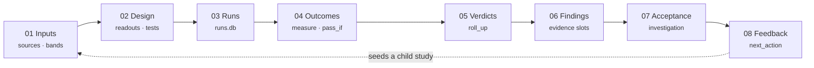

---
tags:
  - rigor
  - provenance
  - report-card
---

# Rigor & the evidence engine

A study's conclusion is **computed from its evidence, not asserted**. This chapter is about
the machinery that makes that sentence true — the deterministic pipeline that reads a run,
measures it, rolls the measurements up into a verdict, and writes the whole chain back into
the study's own files so a human can audit every hop.

!!! quote ""
    Simulation you can compose. **Reasoning you can audit.**

!!! info "On this page"
    **Assumes** [Studies](studies.md), [Investigations](investigations.md). · **You'll learn** the evidence spine, the parallel-slot convention, and why the verdict is computed rather than asserted.

## The big idea: code where prose used to be

An [investigation](investigations.md) is a structured research effort — a shared question, a
set of [studies](studies.md), each with baselines, variants, runs, acceptance criteria,
findings, and expert feedback. Traditionally, the connective tissue between "here is a run"
and "here is what it means" is **prose**: an agent or a scientist writes a paragraph asserting
that the model passed. Prose is where results quietly drift away from the evidence that is
supposed to back them.

The **evidence spine** (the *investigation spine*) replaces that prose tissue with **code**.
Information flows from sources to conclusions through deterministic Python functions that read
structured data, compute results, and write them back into the project's YAML files. Nothing
in this path is an LLM: it is ordinary, testable, reproducible Python. The AI's job is to
*author* the inputs — the question, the tests, the mechanism prose — while the spine *derives*
everything downstream.

<p class="viva-pull">You never hand-write <code>status: pass</code>. The verdict is a function
of the latest run's measured outcomes — which is exactly what stops a study from claiming a
result it never produced.</p>

## The parallel-slot convention

The spine's central trick is deceptively simple. For every place a human (or an AI acting as
author) records **intent**, there is a **parallel slot** the code fills with **derived
evidence**. The two never share a field. Authored intent is preserved verbatim; computed
evidence lands beside it; and the dashboard compares them.

| What it is | Authored slot (human intent) | Computed slot (code-derived) |
|---|---|---|
| Per-run test results | `runs[].outcomes` | `runs[].computed_outcomes` |
| Study conclusion | `executive.verdict` | `.computed_acceptance` |
| Gate state | `pipeline_gate.gate_status` | `.gate_evaluator` |
| A finding | `finding.statement` / `.summary` | `finding.evidence` / `.expected` / `.provenance` |

When the computed slot disagrees with the authored one, the reconciler raises a
**`diverges_from_authored`** flag — and *that flag is the dashboard headline*. A study whose
author wrote "passing" but whose code-computed acceptance says otherwise does not render as
passing; it renders as **diverged**, in red, with both values shown. Drift becomes impossible
to hide because the disagreement is a first-class, diffable fact.

!!! tip "Why the split earns its keep"
    Authored and computed values live in the same file but in different fields, so a single
    `git diff` shows you *both* what a claim asserts and whether the evidence still supports it.
    Auditability, drift detection, and self-documenting studies all fall out of this one
    convention.

!!! note "Where these live in code"
    All four coded slots are real fields in `viva_superpowers`, not just design vocabulary:
    `runs[].computed_outcomes` (written by `study_evaluator` / `study_outcomes`),
    `executive.computed_acceptance` (`investigation_status`), and
    `pipeline_gate.gate_evaluator` (`study_verdict.write_gate_evaluator`) — the last two each
    carrying the `diverges_from_authored` flag. The `study_outcomes.sync()` entry point drives
    the reconciliation. Each write is a comment-preserving ruamel round-trip that only ever
    fills the coded slot and never touches the authored one beside it.

## Compute → Show → Act

The spine is layered into three planes. The bottom plane computes; the middle plane renders
what was computed; the top plane turns the rendered state into the next scientific action.

<div class="viva-grid" markdown>

<div class="viva-card" markdown>
### :material-cog: 1 · Compute
The eight-stage spine. Deterministic Python reads sources and runs, measures outcomes, rolls
them into verdicts and findings, and reconciles authored ↔ computed with one
`study_outcomes.sync()`.
</div>

<div class="viva-card" markdown>
### :material-eye: 2 · Show
Spine presentation. Code-vs-authored chips, `diverges_from_authored` badges, per-readout
validation marks, and a verdict-annotated study graph — all rendered by the **AI-free**
[Workbench](workspaces-and-workbench.md).
</div>

<div class="viva-card" markdown>
### :material-arrow-decision: 3 · Act
The active layer — **Propagate · Navigate · Guide**. Expert feedback becomes a tracked action,
which writes a finding's `next_action`, which seeds a child study. The loop closes on itself.
</div>

</div>

### The eight-stage spine

Every study's evidence flows through the same ordered stages. Each stage reads the one before
it and writes a different part of the study file.



The reflexive loop at the end — feedback seeding the next study — is what makes the spine an
*engine* rather than a report format: an investigation propagates, shows, and acts on its own
knowledge.

## The spine gates

Between stages sit **gates**: each is a deterministic verifier with a small, fixed result
vocabulary. A gate never guesses; when it cannot resolve something it says so explicitly, in a
bucket a human can act on.

| Gate | Question it answers | Result vocabulary |
|---|---|---|
| **Observable** | Does this readout resolve to a real emission in the model's structure? | `ok` · `unresolved` · `not_in_structure` · `aspirational` |
| **Outcome** | Did the run clear the test's bar? | `PASS` · `FAIL` · `PARTIAL` · `BLOCKED` |
| **Citation** | Is this acceptance band backed by a literature source? | cited · uncited |
| **Parameter drift** | Did the run honor the study's enforced parameters? | in-band · drifted |
| **Study** | Do this study's prerequisites and outcomes let it conclude? | passed · failed · needs_calibration · blocked |
| **Investigation** | Do the member studies' verdicts satisfy the acceptance criteria? | met · partial · unmet |
| **Feedback** | Has each expert item been resolved into an action? | open · actioned · closed |

These compose into a single **gate trail** — the audit path from a raw source all the way to a
resolved expert note:

!!! quote ""
    `source → band → readout validation → run → outcome → study verdict → finding →
    investigation acceptance → feedback status`

The **observable gate** deserves special emphasis because it is the *never-fabricate guard*: a
readout marked `not_in_structure` means the study declared an observable the composite cannot
actually emit. The spine refuses to invent a number for it — it buckets it as unresolved and
tells you a human (or a model change) is needed.

## The three rules

Every write the spine makes obeys three rules. They are the ethical spine of the evidence
spine, and they recur across every design document.

<div class="viva-grid" markdown>

<div class="viva-card" markdown>
### :material-account-check: Never clobber the human
Authored intent and machine evidence live in **parallel fields**. Code fills the *absent*
computed slot; it never overwrites what a person wrote. Your `verdict` stays exactly as you
typed it — beside, not under, the computed one.
</div>

<div class="viva-card" markdown>
### :material-help-circle: Never guess
When something cannot be resolved, the spine **buckets it** (`code` · `agent` · `needs_rerun`)
rather than fabricating a verdict. A closed, `eval`-free DSL means a measurement either
computes honestly or reports that it could not.
</div>

<div class="viva-card" markdown>
### :material-history: Never destroy provenance
Every write is **comment-preserving** (ruamel round-trip) and lands as a **git commit**.
Verdict, readiness, and open debts are reproducible, auditable, and diffable. The history *is*
the evidence trail.
</div>

</div>

## Behavior tests as machine-checkable specs

The unit that drives all of this is the **behavior test**: not prose, but a spec that names
*how to measure* a result from a run and *what passing means*. Because the same definition
drives both execution and the dashboard's pass/fail rendering, a test is required to have four
properties:

- **Executable** — a `measure` (a path into the run's structure, a reduction, a window) that a
  deterministic reader can evaluate against `runs.db`, with no human in the loop.
- **Honest** — a `gate_class` that distinguishes an *acceptance criterion* (a directional prior
  stated before the run) from a *regression pin* (a threshold set after seeing the data), so a
  study cannot quietly tune the model to pass a bar it drew after the fact.
- **Traceable** — `requires_simulation` and `cites` bind the verdict to a *specific run* and to
  the *literature*, so the number and its justification travel together.
- **Renderable** — one structured object drives execution *and* the pass/fail pill, so what you
  read on the dashboard is the same fact the grader computed.

### A worked example: the DnaA-ATP fraction

Here is a real behavior test from the `dnaa-replication` line of work. It asks whether the
fraction of DnaA bound as DnaA-ATP stays inside its biologically expected band, **in every
generation**, over a multi-generation run.

```yaml
behavior_tests:
  - name: dnaa_atp_fraction_in_band
    classification: primary
    gate_class: acceptance_criterion
    measure:
      kind: generation_average
      path: "MONOMER0-160[c] / (PD03831[c] + MONOMER0-160[c] + MONOMER0-4565[c])"
    pass_if:
      op: in_range_every_generation
      low: 0.2
      high: 0.5
    requires_simulation: baseline
    cites: [Boesen2024]
```

When the report card runs, the spine resolves each `[c]` token to a real store path, evaluates
the ratio with a safe AST resolver (no `eval`), averages it per generation, and checks the
band. It does **not** write `pass: true`; it writes a structured, per-generation measurement:

```yaml
computed_outcomes:
  dnaa_atp_fraction_in_band:
    evaluated_by: code
    result: PASS
    operator: generation_average/in_range_every_generation
    measured_value: { 1: 0.499, 2: 0.421, 3: 0.388, 4: 0.352, 5: 0.310, 6: 0.271, 7: 0.225 }
```

The verdict is now *derived* from those seven numbers. If generation 7 had dipped to `0.18`,
`result` would flip to `FAIL` on its own — and if the authored `executive.verdict` still said
"passing," the `diverges_from_authored` flag would fire. The measurement chain that made this
possible runs `structure → readout → self-describing store → RunReader → measure → verdict`,
with the run reader living in the sibling emitters package so the dashboard never has to.

!!! quote "A behavior test is a machine-checkable spec, not prose."
    Two studies that cite the same band and measure the same path will grade the same way,
    forever, on any machine that can replay the run.

## Hardening a study

A study that *looks* done is not the same as a study whose conclusions survive scrutiny.
**Hardening** is the transformation that closes the gap between the two — and because a study
is typed data, hardening is a transformation an agent can apply and a human can verify, not a
matter of taste.

Three moves carry most of the work — one standalone skill plus two of its sibling subcommands:

| Move | What it hardens |
|---|---|
| [`/viva-harden-investigation`](../reference/skills.md) | Finds the **one load-bearing gap** that most weakens the headline claim — an unbacked scaffold, a knife-edge single-seed pass, an overclaimed verdict, a failing gate with a real divergence — and closes *that one* the right way for its kind, rather than pouring generic rigor onto an un-diagnosed failure. |
| [`/viva-tests cite-bands`](../reference/skills.md) | Surfaces candidate evidence from expert PDFs for **uncited acceptance bands** and writes structured `cites` / `calibration_anchor` provenance into the study — so a threshold traces to a paper instead of being a magic number. Every write goes through the sanctioned `POST /api/band-provenance` path; the skill never fabricates a threshold. |
| [`/viva-harden-investigation biology-forward`](../reference/skills.md) | Runs the deterministic populate step first (`populate_finding_observations` fills `evidence.observed`, `expected.range`, `divergence_factor`, `provenance.run_ids` from the computed outcomes and bands), **then** guides the author to write the biological interpretation over that scaffold. A `divergence_factor > 0` forces the status to `partial` or `contradicts` — never `confirms`. Numbers first, mechanism prose second. |

!!! note "Skill surface consolidated (#281)"
    At the current package HEAD the `/viva-*` surface was consolidated (21 → 17 skills), so
    band-citing is now the `cite-bands` subcommand of [`/viva-tests`](../reference/skills.md) and
    biology-forward authoring is a mode of `/viva-harden-investigation`. Older installed plugin
    builds may still expose `/viva-cite-bands` and `/viva-biology-forward` as standalone skills;
    the behavior is the same either way.

!!! warning
    Hardening never means "sprinkle more seeds everywhere." A failing report-card gate with a
    real divergence must be **root-caused before it is patched** — and a verdict of *real and
    understood* (no bug found) is itself a complete hardening. The point is to explain the
    signal, not to bury it under undifferentiated rigor.

## Authored vs computed: the whole picture

Pulling it together, here is who writes what across a study's spine. The left column is where
human (or AI-as-author) judgment lives; the right is what the deterministic engine derives.

| Stage | You (or an AI) author… | The spine computes… |
|---|---|---|
| **Design** | the question, readouts, behavior tests, acceptance bands | readout resolution status (observable gate) |
| **Runs** | which composite to run, with what perturbations | `runs.db` trajectories + run provenance |
| **Outcomes** | — | `computed_outcomes` per test (measure → `pass_if`) |
| **Verdicts** | your intended `executive.verdict` | `computed_acceptance` + `diverges_from_authored` |
| **Findings** | `statement`, `summary`, `explanation`, `status` | `evidence`, `expected.range`, `divergence_factor`, `provenance` |
| **Acceptance** | the investigation's acceptance criteria | which criteria are met / partial / unmet |
| **Feedback** | the expert note and the decision it demands | the tracked action → the child study it seeds |

!!! quote ""
    You can re-run the science without rewriting the argument — and audit the argument without
    re-reading the code.

---

**Next:** [Working with AI agents](working-with-agents.md)
