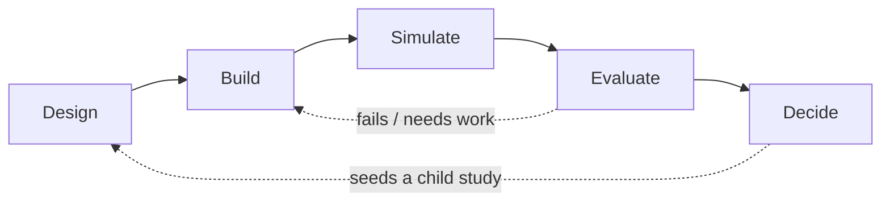

# Studies

!!! quote "The one sentence"
    A **Study** wraps one question, one emit-contract, and one pass/fail bar around a
    [Composite](../compute/composites-and-wiring.md).

A composite is reusable across many questions. A study attaches *one* of those questions
to it: which composite to run, what to measure, and what "passing" means. An
[Investigation](investigations.md) then lets a dozen such questions accumulate into a
defensible claim.

<p class="viva-pull">Separating them means you can re-run the science without rewriting the
argument — and audit the argument without re-reading the code.</p>

A study is **never compiled into a composite of its own.** It stays *metadata that points
at* a composite by a dotted id and reads back what came out. That is the whole design: the
composite runs, the study records.

## Three on-disk layers

| Layer | File | What it is |
|---|---|---|
| **Investigation** | `investigations/<slug>/investigation.yaml` | a named collection of studies = a git branch = a worktree |
| **Study** | `studies/<slug>/study.yaml` | one question + its narrative spine (nests under its investigation, or flat for legacy) |
| **Composite** | `viva_<pkg>/composites/<id>.composite.yaml` | the runnable process-bigraph document |

Read top-down it is an argument; read bottom-up it is a simulation.

## The five-phase lifecycle

Authoring a study runs through five phases. They are coarsely sequential and iterative in
practice — **Evaluate routinely sends you back to Build.** Each phase *writes a different
part of the study spine*:

| Phase | Produces | Writes to |
|---|---|---|
| **Design** | the spec: question, gate, run set, tests | `purpose`, `pipeline_gate`, `simulation_set`, `behavior_tests`, `readouts` |
| **Build** | executable code: Process classes + composites | `model_change`, `implementation_requirements`, the composite files |
| **Simulate** | the runs: trajectories | `runs.db` |
| **Evaluate** | the verdict: test results + figures | `outcomes`, `visualizations`, `findings` |
| **Decide** | conclusion + follow-ups | `conclusion_verdicts`, discovery implications |



The `phase:` field on a study is a capitalized enum — `Design | Build | Simulate |
Evaluate | Decide`. An investigation card surfaces its *slowest-phase* member, so one
study stuck in Design holds the whole investigation in Design.

!!! note "Phases vs the study-detail 'acts'"
    On the study-detail page the same work is grouped into five reading *acts* — **Study**
    (overview) · **Design** (what you author) · **Evidence** (what came back) · **Assurance**
    (what grades it) · **Decision**. The load-bearing boundary there: a **report card
    grades** (→ Assurance › Tests); an **analysis derives** with no verdict (→ Evidence ›
    Analyses). See [Analyses, visualizations & report cards](analyses-visualizations-report-cards.md).

## How a study uses its composite — the five join fields

A study does not rebuild its composite. It *specializes* one through exactly five fields:

<div class="viva-grid" markdown>

<div class="viva-card" markdown>
### 1 · Baselines
`baseline[]` (or v4 `conditions.baseline`) — the runnable composite(s). A **non-empty
list** so a study can compare several composites side by side: `{name, composite, params}`.
</div>

<div class="viva-card" markdown>
### 2 · Variants
`variants[]` — **parameter overrides only**: `{name, base_composite, parameter_overrides}`.
No structural or initial-state edits; `base_composite` must name an existing baseline entry.
</div>

<div class="viva-card" markdown>
### 3 · Simulation set
`simulation_set[]` — the run recipe (base model, perturbation, condition, seeds, duration).
In v4 it *replaces* the separate v3 `variants:` + `interventions:` lists.
</div>

<div class="viva-card" markdown>
### 4 · Readouts — the emit contract
`readouts[].store_path` — ties a named observable to the **exact emission path** in the
composite's output. This is the contract that says *what the run must emit* to be gradable.
</div>

</div>

<div class="viva-card" markdown>
### 5 · Behavior tests — the verdict
`behavior_tests[]` — a machine-checkable spec: a `measure` (how to extract a number from
run history) plus a `pass_if` (op + value/range). This is what turns a trajectory into a
pass or fail. A test may carry a `variant:` sub-field to scope it to one named variant.
</div>

Running a baseline (`POST /api/study-run-baseline`) resolves the baseline id, **builds
that composite in-process**, merges the params, runs it, and records the trajectory in
`runs.db`. The study itself is never compiled.

## Derive-on-read: verdicts are computed, never asserted

This is the single most important rule of the study spine, and it is worth internalizing:

!!! quote ""
    A study's conclusion is **computed from its evidence, not asserted.** You never write
    `status: pass` by hand. A per-test pass/fail pill is derived from the latest run's
    `outcomes[test].result` in `runs.db`. This is what stops a study from *claiming* a
    result it never produced.

The spine keeps **authored** intent and **computed** evidence in *parallel* fields, and a
`diverges_from_authored` flag is the dashboard headline when they disagree:

| Authored (a human writes) | Computed (code fills, on read) |
|---|---|
| `runs[].outcomes` | `runs[].computed_outcomes` |
| `gate_status` | `pipeline_gate.gate_evaluator` |
| `executive.verdict` | `.computed_acceptance` |
| `finding.statement` / `.summary` | `finding.evidence` / `.expected` / `.provenance` |

So a test authored `status: passed` but backed by **no** run outcome renders as a pending
pill (<span class="pill draft">pending</span>), not a pass. A study renders
**Ran · Tests N&check; · Passed** only when `runs[].outcomes` actually back the results.

The rolled-up **verdict** (`study_verdict.roll_up_verdict()`) aggregates outcomes and
prerequisites into a code-computed gate state — passed iff `fail == 0 and pass > 0`:

<span class="pill pass">passed</span>
<span class="pill fail">failed</span>
<span class="pill draft">needs_calibration</span>
<span class="pill draft">blocked</span>
<span class="pill draft">not_started</span>

It writes a *parallel coded slot* and never overwrites the authored gate.

!!! quote ""
    Because the study is typed data, hardening it — filling gaps, citing bands, tightening
    a claim — is a transformation an agent can apply and a human can verify, not a vibe.

## "Five phases" vs "six status axes"

Two similar-looking lists travel together in the docs. Keep them distinct:

<div class="viva-grid" markdown>

<div class="viva-card" markdown>
### Five **phases** — a sequence
`Design → Build → Simulate → Evaluate → Decide`. *Where you are* in authoring the study.
One value at a time; the `phase:` field.
</div>

<div class="viva-card" markdown>
### Six **status axes** — independent dimensions
`design · implementation · simulation · evaluation · gate · expert_review`. Each is a
*separate*, nullable axis, so "we wrote it" is never confused with "it ran" or "it holds up."
</div>

</div>

The six axes replace the single coarse `status:` field for new specs, each with its own
enum (e.g. `simulation_status: not_run · running · ran · failed`;
`gate_status: blocked · needs_calibration · passed · failed`). The headline pill on
the study page prefers `gate_status` when set. They are additive — a legacy study with only
`status:` renders exactly as before.

## The `study.yaml` narrative spine (v4)

A v3 `study.yaml` is organized into **eight canonical sections** plus two cross-cutting
fields. The v4 schema adds a *second layer* of optional **narrative-spine** fields — the
shape the DnaA-replication investigation evolved through use, now promoted to
canonical-optional. A v3 spec validates unchanged against v4; new scaffolds land the v4
fields commented in as TODO placeholders.

**The eight canonical sections:**

| # | Section | YAML field(s) |
|---|---|---|
| 1 | Purpose | `purpose:` (`question` / `mechanism` / `expected_outcome`) |
| 2 | Pipeline Gate | `pipeline_gate:` (`prerequisites` / `enables` / `proceed_condition`) |
| 3 | Simulations | `simulation_set:` (replaces v3 `variants:` + `interventions:`) |
| 4 | Build | `model_change:` + `implementation_requirements:` |
| 5 | Readouts | `readouts:` (replaces v3 `observables:`; each carries `status`) |
| 6 | Tests | `behavior_tests:` (replaces v3 `expected_behavior:`) |
| 7 | Limitations | `limitations:` |
| 8 | References | `bibliography:` |

Cross-cutting: `key_assumptions:` (pairs with Build) and `conclusion_logic:`
(`if_primary_tests_pass:` / `if_primary_tests_fail:`, pairs with Tests).

**The v4 narrative spine, four layers** (all optional; the six ★ fields are authored first
and render at the top of the report):

- **Executive** — `title`, `claim`, `confidence` (`Accepted | Investigating | Planned |
  Refuted`), `runtime`, **★ `report:`** (verdict / confidence / evidence_quality /
  key_metrics), **★ `study_card:`** (one-paragraph card).
- **Framing** — **★ `question:`** + `assumptions:`, **★ `conditions:`** (the grouped v4
  alternative to top-level `baseline:` + `variants:`, whose `model_settings[]` is the
  source of truth for tunable parameters — current value + default + literature range +
  cite), `enforced_params:` (values each run is *required* to apply).
- **Validation** — **★ `behavior_tests:`**, **★ `readouts:`** (`store_path` = the emit
  contract), `biological_summary:` (textbook prose), `literature_anchors:`.
- **Implementation + decisions** — `model_change`, `implementation_requirements`,
  `design_pivot_required:` (open decision points), **★ `conclusion_verdicts:`** — a
  three-track block `{regression_compatibility, biological_validation, explanatory_gain}`,
  each `{result, basis}`, so a study can be "PASS on regression but MIXED on biology"
  instead of one forced boolean.

!!! warning "Accuracy note — the schema version is in flux"
    Study specs exist as **v2 → v3 → v4**, migrated on load. This chapter presents **v4**;
    the `schema_version:` field selects the shape (and, at v4, the presence of a top-level
    `conditions:` block disambiguates two v4 variants). Set `schema_version: 4` to opt into
    the v4 reserved field names. A handful of names are **reserved** at v4 and were renamed
    from v3 to avoid collisions — `references:` → `bibliography:`, `tests:` is reserved (so
    the field is `behavior_tests:`). When in doubt, read a live `study.yaml` in a real
    workspace rather than inventing a field.

### A realistic `study.yaml` skeleton

Faithful to the shipped shape; values truncated to placeholders.

```yaml
schema_version: 4
name: dnaa-01-expression-dynamics       # the slug is the technical id
title: DnaA expression dynamics          # human display name (v4 spine)
created: '2026-08-14'
phase: Evaluate                          # Design | Build | Simulate | Evaluate | Decide

# --- six independent status axes (replace the coarse `status:`) ---
design_status: approved
implementation_status: complete
simulation_status: ran
evaluation_status: evaluated
gate_status: needs_calibration
expert_review_status: requested

# 1 · PURPOSE
purpose:
  question: |
    Does DnaA-ATP fraction cycle within its literature band across generations?
  mechanism: |
    Titration of DnaA by datA and the chromosomal DnaA boxes.
  expected_outcome: |
    DnaA-ATP fraction stays within 0.2-0.5, oscillating once per division.

# 2 · PIPELINE GATE
pipeline_gate:
  prerequisites: []                      # parent study slugs (bare slug or {study, condition})
  enables: [dnaa-02-initiation]
  proceed_condition: tests-passed

# 3 · SIMULATIONS  (v4 grouped form)
conditions:
  baseline:
    composite: v2ecoli.composites.baseline.baseline
    params: {}
  variants:
    - name: high-datA
      base_composite: baseline
      parameter_overrides: { datA_copies: 2 }
  model_settings:
    - name: dnaa_synthesis_rate
      current: 0.85
      default: 1.0
      range: [0.5, 1.5]
      units: 1/s
      cites: [Hansen2018]

# 4 · BUILD
model_change:
  - kind: change_config
    path: processes.dnaa
implementation_requirements: []

# 5 · READOUTS  (the emit contract)
readouts:
  - name: dnaa_atp_fraction
    store_path: listeners.dnaa.atp_fraction
    status: available
    units: dimensionless

# 6 · TESTS  (measure + pass_if -> the verdict)
behavior_tests:
  - name: atp-fraction-in-band
    classification: primary
    measure:
      kind: generation_average           # the discriminating sub-key is `kind`
      path: listeners.dnaa.atp_fraction
    pass_if: { op: in_range_every_generation, low: 0.2, high: 0.5 }
    cites: [Boesen2024]

conclusion_logic:
  if_primary_tests_pass: |
    DnaA titration reproduces the observed cycling band.
  if_primary_tests_fail: |
    Revisit the datA titration parameters before advancing.

# --- v4 executive spine (authored last, renders first) ---
report:
  verdict: passing-with-caveats          # free-form; computed acceptance sits alongside
  confidence: medium
  evidence_quality: literature-matched
  key_metrics: [dnaa_atp_fraction]
conclusion_verdicts:
  regression_compatibility: { result: PASS, basis: "matches v1 baseline" }
  biological_validation:    { result: MIXED, basis: "band met in 6/7 generations" }
  explanatory_gain:         { result: POSITIVE, basis: "resolves initiation timing" }

# 7 · LIMITATIONS
limitations: |
  Single-seed; ensemble replication pending.

# 8 · REFERENCES
bibliography:
  - Boesen2024
  - Hansen2018

# provenance — outcomes are written by the run, never by hand
runs: []                                 # {run_id, outcomes{...}} — filled from runs.db
findings: []
```

!!! note "You author fields; you do not author verdicts"
    The `runs[].outcomes`, `computed_outcomes`, the rolled-up gate verdict, and the
    per-finding `evidence`/`provenance` slots are all **derive-on-read**: code fills them
    from the latest run in `runs.db`. Your job is the *authored* side — the question, the
    tests, the bands, the prose. See [Rigor & evidence](rigor-and-evidence.md) for how the
    computed side is graded.

## Where studies fit

- Build the composite a study runs → [Composites & wiring](../compute/composites-and-wiring.md).
- Grade the runs, render figures and report cards → [Analyses, visualizations & report cards](analyses-visualizations-report-cards.md).
- Group studies into a gated argument → [Investigations](investigations.md).

---

**Next:** [Analyses, visualizations & report cards](analyses-visualizations-report-cards.md)
