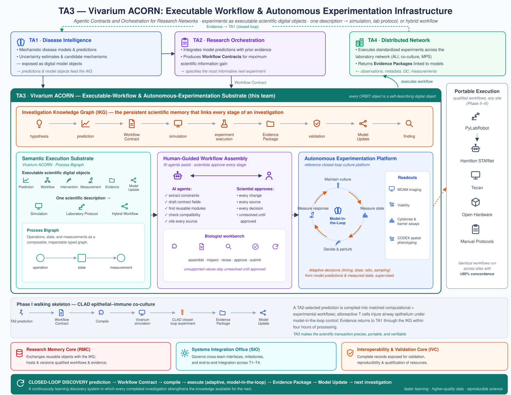
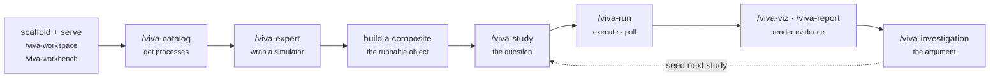

---
tags:
  - agents
  - workbench
  - api
---

# Working with AI agents

The agentic spine is *what reasons* — but it reasons through a tool that contains no AI at all.
This chapter is about that seam: how the `/viva-*` skills drive the [Workbench](workspaces-and-workbench.md)
over a plain HTTP contract, and how the work divides between an AI agent doing high-throughput
construction and a human curator owning the calls that matter.

!!! quote ""
    Same artifact, two kinds of author.

<figure class="viva-figure">

<figcaption>The agentic loop: AI agents assemble and run the investigation graph —
hypothesis → prediction → workflow → simulation → evidence → validation → model update —
over a process-bigraph execution substrate, with a human approving the stages that matter.</figcaption>
</figure>

!!! info "On this page"
    **Assumes** [Workspaces & the Workbench](workspaces-and-workbench.md), [Rigor & the evidence engine](rigor-and-evidence.md). · **You'll learn** the AI-free-tool / swappable-plugin split, how the `/viva-*` skills drive the Workbench over plain HTTP, and how work divides between agent and human curator.

## The split: AI-free tool, swappable AI plugin

The single most important architectural decision for agents is that the AI and the tool are
**two separate layers, and they stay separate**:

<div class="viva-stack" markdown>

<div class="layer" markdown>
**The AI layer — `viva-superpowers`.** The `/viva-*` Claude Code skills. All AI capability in
the ecosystem lives here. The skills are thin clients: shell, `curl`, and Python-helper calls
against the Workbench's HTTP API. Swap this layer for a different model or a different agent and
nothing below it changes.
</div>

<div class="layer" markdown>
**The tool layer — `vivarium-workbench`.** The dashboard server, its data, its evidence
rendering. Pure Python, **no AI dependencies**. It runs composites, renders the study and
investigation UI, and commits every change to git. It behaves identically whether an AI, a
script, or a human at a keyboard is driving it.
</div>

</div>

Why go to this trouble? Two payoffs, and they are the whole reason the platform can be trusted:

- **Auditability.** The evidence you read on the dashboard was rendered deterministically from
  declared fields by code with no model in the loop. There is no prompt that could have talked
  it into a rosier verdict. The [evidence spine](rigor-and-evidence.md) computes; the AI only
  authors the inputs.
- **Replaceable AI.** Because every capability the AI has is expressed as an HTTP call any
  client could make, the AI is a *plugin*, not a dependency. The tool outlives any particular
  model.

!!! quote ""
    All AI capability is packaged as the `viva-superpowers` plugin — a set of `viva-*` skills
    that call the Workbench's HTTP API. **This keeps the tool auditable and the AI swappable.**

## The agent access contract

Any agent — a `/viva-*` skill, a script, a different model entirely — drives the Workbench
through the same small contract. Follow it and your agent behaves; break it and you get the
classic failures (a hardcoded port that moved, a "success" that was really a failed run
returning HTTP 200).

**1 · Resolve the base URL — never hardcode it.**
On start, the server writes a small JSON blob to `.pbg/server/server-info` whose `url` field is
the live base URL (alongside `port`, `host`, `pid`). That file is how *everything*, agents
included, discovers the server. Read the `url` key; never assume a port.

```bash
BASE=$(python3 -c "import json; print(json.load(open('.pbg/server/server-info'))['url'])")  # e.g. http://127.0.0.1:8765
curl -s "$BASE/api/workspace-manifest" | head
```

**2 · Orient in one call, then two.**
Before editing anything, get situational awareness. `GET /api/workspace-manifest` returns the
workspace, composites, studies, registry, health, and installed skills in a single snapshot —
start there. `GET /api/linkage-index` returns the deterministic cross-reference graph: what
links to what, which studies cite a source, which findings measure an observable.

**3 · Runs are asynchronous — check the result, not the status.**
A run returns a `run_id` and comes back later. Poll its status endpoint until it is done, then
read the run's **result field**. A *failed run can still return HTTP 200* — the durable truth is
in `studies/<slug>/runs.db`, not in the HTTP envelope. Confusing "the request succeeded" with
"the run passed" is the most common agent mistake.

**4 · Every write is a git commit.**
There is no separate "save." Each mutating call the tool commits to git, so every action an
agent takes has an audit trail and is reversible. This is what makes high-throughput,
agent-driven construction safe: nothing an agent does is invisible or unrecoverable.

!!! tip "The golden rules, in one line"
    Read `.pbg/server/server-info` for the URL · orient via `/api/workspace-manifest` first ·
    trust `/openapi.json` for shapes · runs are async (poll, and check the *result*, not just
    HTTP 200) · every write is a git commit. See the [HTTP API reference](../reference/http-api.md).

## The authoring arc

Most agent sessions walk the same arc, from an empty workspace to a closed investigation with a
report. Each step is a skill; each skill is a client over the contract above.



| Step | Skill | What the agent does |
|---|---|---|
| **Scaffold & serve** | `/viva-workspace`, `/viva-workbench` | Create the workspace (`workspace.yaml` + a `viva_<pkg>/` package), start the dashboard server. |
| **Catalog** | [`/viva-catalog`](../reference/skills.md) | List, install, or uninstall the workspace's module catalog — pull in the processes you need. |
| **Wrap** | [`/viva-expert`](../reference/skills.md) | Wrap a real upstream simulator as a typed Process (or compose several). The default is to bridge the *genuine* tool, never a stub. |
| **Compose** | — | Assemble the wrapped processes into a [composite](../compute/composites-and-wiring.md) — the only object the engine runs. |
| **Ask** | [`/viva-study`](../reference/skills.md) | Wrap one question, one emit-contract, and one pass/fail bar around the composite. |
| **Run** | [`/viva-run`](../reference/skills.md) | Execute a composite for N steps; poll to completion; read the emitted observables. |
| **Render** | [`/viva-viz`](../reference/skills.md), [`/viva-report`](../reference/skills.md) | Generate interactive figures and regenerate the reviewer-ready report. |
| **Argue** | [`/viva-investigation`](../reference/skills.md) | Group studies under one research question into a gated DAG; close it into a report and a PR. |

The full set is in the [skill catalog](../reference/skills.md). The arc is a loop, not a line:
a finding's `next_action` [seeds the next study](rigor-and-evidence.md), and the agent rides
that loop at every hop — proposing studies, running composites, hardening findings, reading
verdicts to choose what to ask next — while every step stays legible to a human on the study
page.

## Curator and agent: the division of labor

The investigation graph is a **shared surface** that two very different kinds of author edit.
Getting the boundary right is what makes high-throughput AI construction *trustworthy* rather
than merely fast.

<div class="viva-grid" markdown>

<div class="viva-card" markdown>
### :material-robot: The agent does the volume
High-throughput **construction and analysis**: building studies, wrapping simulators, running
and sweeping composites, drafting visualizations, populating finding scaffolds, maintaining the
graph. Agents work **in parallel, in isolated worktrees** — one investigation per branch per
worktree — so concurrent sessions never trample each other's runtime state.
</div>

<div class="viva-card" markdown>
### :material-account-tie: The curator owns the judgment
The **irreversible, framing decisions**: what question is worth asking, whether a verdict is
justified, when to merge, whether a correction should propagate upstream. These are matters of
scientific taste, and they stay with a human.
</div>

</div>

The co-authoring loop, in five beats: the **curator frames** → the **agent implements** → the
**spine executes and the grader scores** (PASS / PARTIAL / FAIL, deterministically) → the
**agent analyzes** → the **curator reviews, sets the verdict, and decides the merge**;
corrections then propagate upstream.

Two responsibilities the curator must never delegate, because the structure exists specifically
to guard against them:

!!! warning "Guard against tune-to-pass and over-claiming"
    - **Tune-to-pass.** An agent optimizing for a green pill will happily draw the acceptance
      band *after* seeing the data. The `gate_class` split (an `acceptance_criterion` — a
      directional prior stated before the run — versus a `regression_pin` set afterward) and
      pre-registered thresholds exist to catch this, but the curator is the one who verifies a
      bar was set honestly, before the run.
    - **Over-claiming.** A confident verdict on thin evidence is the failure the
      [`diverges_from_authored`](rigor-and-evidence.md) flag and `/viva-harden-investigation`
      are built to surface. The curator reconciles the claim to what the evidence actually
      supports.

!!! quote ""
    **Never auto-merge.** A merge is a scientific commitment; the human always approves it. AI
    augments the investigation — it never replaces scientific accountability.

The reason the boundary can be this clean is everything in the two preceding chapters: the tool
is AI-free, so what the agent produces is graded by code; the evidence is computed, not
asserted, so a curator reviewing an agent's study is reviewing *facts the spine derived*, not
prose the agent wrote. Structure is what makes an agent-assembled model trustworthy rather than
plausible-looking.

---

**Next:** [Skill reference](../reference/skills.md)
