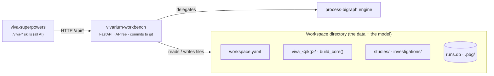

# Workspaces & the Workbench

Everything in the [Investigate](studies.md) half of the guide happens in one place: a
**workspace** — a directory that *is* the model — driven by the **Workbench**, an
AI-free server that turns that directory into a git-backed research notebook.

<p class="viva-pull">A workspace is where research happens; the Workbench is the loop
turning inside it. The data lives in the workspace, never in the server.</p>

## The one crucial split

The Workbench is *tooling*; the workspace is *data*. They are separate on purpose.

<div class="viva-grid" markdown>

<div class="viva-card" markdown>
### :material-server: `vivarium-workbench` — the server
A single-process **FastAPI** web app. It has **no database of its own** and **no AI**.
It reads and writes plain files in a workspace directory and delegates every simulation
to `process-bigraph`. Every mutating action commits to the active git branch, so there
is a full audit trail.
</div>

<div class="viva-card" markdown>
### :material-folder-cog: the workspace — the data
A git repository holding the model's Python package, its composites, its studies and
investigations, its references, and its results. It is the **unit of reproducibility**:
clone it, run it, get the same answer. The server runs *inside the workspace's own venv*.
</div>

</div>

The dependency arrow points one way: the **workspace depends on** `vivarium-workbench`
(it is a pip dependency in the workspace's `pyproject.toml`), never the reverse. That is
why the server can import the workspace's own package and any installed simulator stacks
— it is running in their environment.



!!! quote ""
    The Workbench is AI-free. All AI capability is packaged as the `viva-superpowers`
    Claude Code plugin — a set of `/viva-*` skills that drive the Workbench's HTTP API.
    This keeps the tool auditable and the AI swappable.

## Modules vs workspaces

Two nouns are easy to confuse, so pin them down early:

| | **Module** | **Workspace** |
|---|---|---|
| What it defines | processes, composites, runtime-environment dependencies | studies, composites, investigations — with modules installed |
| Ownership | distributable, versioned, immutable at a version | owned, mutable, *not* itself a unit of distribution |
| Back-reference | a module has no back-reference to any workspace | a workspace holds a list of modules |

A **module** is a `viva-<tool>` / `pbg-<tool>` package that wraps a simulator; a
**workspace** installs several of them and attaches science to the composites they
provide. A **composite-only repo** (e.g. a bare simulator wrapper) has *no*
`workspace.yaml` — just a `pyproject.toml`, a `viva_<slug>/` package, and `tests/` — and
is pulled into a workspace through `workspace.yaml`'s `imports`. You can promote such a
repo into a workspace in place (see [scaffolding](#scaffolding-a-workspace), below).

## What a workspace looks like on disk

A workspace is a directory with a `workspace.yaml` manifest and a `viva_<pkg>/` Python
package that exposes a `build_core()` entry point. Everything else hangs off those two.

```
my-workspace/
├── workspace.yaml                          # the manifest (schema below)
├── viva_<pkg>/                             # the workspace's Python package
│   ├── core.py                             #   build_core() — registers this repo's processes
│   ├── composites/<id>.composite.yaml      #   the runnable substrate (JSON/YAML or a generator .py)
│   ├── processes/                          #   Process / Step classes
│   └── visualizations/                     #   Visualization Steps
├── investigations/<slug>/investigation.yaml   # a collection (= git branch = worktree)
│   └── studies/<slug>/study.yaml           #   studies commonly nest under their investigation
├── studies/<slug>/                         # (flat layout still resolves for legacy studies)
│   ├── study.yaml                          #   a question + its narrative spine
│   ├── runs.db                             #   canonical run + outcome record (SQLite)
│   ├── parquet-runs/<run>/                 #   emitted trajectories (Parquet hive)
│   └── viz/                                #   rendered figures + report cards
├── references/papers.bib                   # shared bibliography
├── notes/                                  # field records — cleanup PRs must SPARE these
└── .pbg/                                   # gitignored runtime state (see below)
    ├── server/server-info                  #   the live server URL every client reads
    ├── runs/<run_id>/                      #   detached-run request + observables
    ├── composite-runs.db · artifacts/      #   run metadata + content-addressed caches
    └── schemas/ · events.jsonl · state.json
```

!!! note "`.pbg/` — a legacy prefix that stayed"
    The runtime control directory is still named `.pbg/`, and the global registry still
    lives at `~/.pbg/`, even in viva-branded workspaces. The `pbg → viva` rename covered
    skills and packages but deliberately left these paths alone so existing tooling keeps
    working. See [A note on names](../foundations/the-stack.md#a-note-on-names).

### The `build_core()` convention

The workspace package's job is to hand the engine a **`Core`** — the type-and-process
registry (see [Schemas, types & state](../compute/schema-types-state.md)). By convention
the package exposes a single `build_core()` function that composes any imported repos'
cores and then registers this repo's own processes:

```python
# viva_<pkg>/core.py
def build_core(core=None):
    core = compose_import_cores(core)              # pull in imported module stacks
    register_package_processes(core, f"{__package__}.processes")
    return core
```

!!! warning "Accuracy note — `viva_` vs `pbg_`, `build_core()` vs `core.py`"
    The ecosystem is mid-migration. **Newer** scaffolds emit a `viva_<pkg>/` package
    exposing `build_core()`. **Older** docs and workspaces show a `pbg_<pkg>/` package and
    refer to the registration entry point simply as `core.py`. The *convention* —
    "the package exposes a `build_core()` that returns a populated `Core`" — is stable;
    only the package prefix and some prose differ. Prefer the `viva_` spelling.

### The `workspace.yaml` manifest

`workspace.yaml` is validated against a Draft-07 JSON schema shipped in the plugin
(`viva_superpowers/schemas/workspace.schema.json`).

**Required:** `schema_version`, `name`, `created` (a date), `plugin_version` (semver).

**Commonly used optional keys:**

| Key | What it declares |
|---|---|
| `package_path` | the `viva_<pkg>/` directory holding the package |
| `default_baseline` | pre-filled composite + params + run-knobs for new study baselines |
| `imports` | a map of imported `pbg-*` / `viva-*` repos a composite instantiates directly (`{source, ref, mode, installed}`) |
| `observables` | named `{name, store_path, units}` observables the workspace tracks |
| `visualizations` · `simulations` · `datasets` | declared figures, run recipes, and input datasets |
| `references_bib` · `references_pdfs` | the shared bibliography and cited PDFs |
| `server.enabled` | whether this workspace runs a dashboard server |
| `ui.composite_view` | which renderer draws composite wiring (`loom-explore` — the default — or legacy `bigraph-viz`) |
| `layout` | optional per-directory relocations (e.g. group `studies/` under `workspace/studies/`) |

!!! warning "Accuracy note — schema version and the `runtime:` block"
    The shipped `workspace.schema.json` pins `schema_version` to the enum `[2, 3]` and does
    not constrain a top-level `runtime:` block. The concept docs describe a
    `runtime:` block (`default_emitter: parquet|sqlite`, `subprocess_timeout_s`,
    `shared_artifacts: [...]`) that migrated workspaces carry; treat it as a documented,
    schema-tolerated convention rather than a required, schema-enumerated field.

## Scaffolding a workspace

The `/viva-workspace` skill (backed by the `viva-scaffold` console script and the `vwb`
CLI) creates a workspace in one of **three modes**, chosen by your starting state:

| Starting state | Mode | Command |
|---|---|---|
| No directory yet, no upstream model repo | **standalone** | `/viva-workspace <name>` |
| No directory yet, want to branch off an existing repo | **upstream-branch** | `/viva-workspace <name> --upstream owner/repo` |
| Already inside a git checkout you want to promote | **in-place** | `/viva-workspace <name> --target . --in-place` |

- **standalone** clones the **viva-template** scaffold (`vwb scaffold-workspace`), runs
  `git init`, creates a `.venv` and `uv pip install -e .[dev]`, commits the bootstrap, and
  registers the workspace in the global catalog (`~/.pbg/workspaces.json`).
- **upstream-branch** clones an upstream model repo, cuts a workspace branch off
  `origin/main`, applies the scaffolding on top, and commits — the recommended path when
  you are adding an investigation to code that already exists.
- **in-place** promotes a checkout you already have (skipping any files that already
  exist), then registers it. This is the right answer for composite-only repos.

!!! note "Template repo naming"
    The scaffold source is the **viva-template** repo. The canonical scaffolder
    (`viva_superpowers/scaffold.py`) defaults its clone URL to
    `vivarium-collective/viva-template`; the older `/viva-workspace` skill prose still
    names `pbg-template`, and either `$VIVA_TEMPLATE` or `$PBG_TEMPLATE` (or
    `--template-source`) overrides it. Same scaffold, two names. After scaffolding,
    `python3 scripts/lint-workspace.py` should print `workspace lint: OK`.

If you prefer to do it by hand, cloning the template and initializing it is equivalent:

```bash
git clone https://github.com/vivarium-collective/viva-template my-workspace
cd my-workspace
bash use-this-template-init.sh          # renders the .j2 scaffolding
uv venv && source .venv/bin/activate
uv pip install -e ".[dev]"              # pulls in vivarium-workbench as a dependency
python3 scripts/lint-workspace.py       # -> "workspace lint: OK"
```

## Starting the server

From the workspace root (the directory containing `workspace.yaml`):

```bash
vivarium-workbench serve --workspace .              # picks a free port, then serves
vwb serve --workspace . --port 8000 --host 0.0.0.0  # vwb is the short alias
bash scripts/serve.sh                               # convenience shim in a scaffolded workspace
```

On start the server writes a JSON **`server-info`** doc to **`.pbg/server/server-info`** —
the file every client and agent reads to discover the server. It carries `port`, `host`,
and a ready-to-use `url` (clients parse it with `json.loads`, not as a bare string).
**Never hardcode a port.**

```bash
BASE=$(python3 -c "import json; print(json.load(open('.pbg/server/server-info'))['url'])")
curl -s "$BASE/api/workspace-manifest"   # one-call situational snapshot — start here
```

Because the server runs in the workspace's venv, it can import the workspace's
`build_core()` and any installed `pbg-*` / `viva_*` simulator stacks directly.

!!! info "Running modes"
    Point the server at a remote **viva-api** backend (`VIVA_API_BASE=...`) to submit runs
    that execute on GovCloud (Ray → AWS Batch → zarr/parquet on S3) and land back as study
    runs. The same codebase, with writes gated to a small whitelist, is what serves the
    **read-only online dashboard** — "the workbench with writes gated."

### Session-per-tab: one workspace per browser tab

The server can host many workspaces at once. It keeps them from colliding with a simple
rule: **a session is pinned to one workspace, per browser tab, for its life.**

- Picking a workspace from the left-rail **workspace switcher** opens it in a **new tab**
  rather than re-pointing the current one — "one workspace per browser tab."
- Session middleware resolves each request's session to a workspace and sets a
  **request-scoped** root (a `ContextVar`), so two tabs on two workspaces never interfere.
- **Runs are workspace-scoped, not session-scoped.** A run outlives the session that
  launched it; another tab on the same workspace sees it in the Runs index.

## The side-rail tabs

The left rail is the map of the Workbench. The shipped labels (authoritative) and what
each surfaces:

| Rail tab | Shows |
|---|---|
| **Resources** | the `workspace.yaml` summary — dependencies, references, datasets, scaffolding status |
| **Catalog** | the marketplace / module catalog: install and list available processes and composites |
| **Processes** | the **Registry** — every Process / Step / Composite the workspace can import |
| **Studies** | the Investigations DAG canvas, grouping studies into research arcs |
| **Runs** | the Simulations DB / runs index — every run across every emitter backend |
| **Analysis** | saved interactive visualizations, 3D viewers, and the Analysis Tools / PTools card |

!!! note "Two vocabularies"
    An earlier README describes "seven tabs" (Workspace · Registry · Composites · Studies ·
    Investigations · Visualizations · GitHub Branches). That is the *conceptual* model; the
    shipped rail above is the reorganized, renamed reality. Sections such as the single-study
    view, the **Composite Explorer**, GitHub Branches, and the audit panel exist but are not
    top-level rail links — they open from within the tabs above.

Every mutating action in any tab commits to the active git branch in the workspace, so
there is a full git audit trail of the investigation as it is built.

## The Composite Explorer (loom)

Opened from the Catalog or Composites views (or with `/viva-explore <spec-id>`), the
**Composite Explorer** browses, configures, and runs a single composite. Its centerpiece
is an embedded **[bigraph-loom](https://github.com/vivarium-collective/bigraph-loom)**
state-tree viewer — an interactive rendering of the composite's place graph and wiring,
served at `/loom-explore`.

The composite **registry** the Explorer draws from is the union of three sources:

1. the workspace's own package `composites/`,
2. every installed `pbg-*` / `viva_*` distribution's `composites/`, and
3. `@composite_generator`-decorated factory functions discovered across those packages.

A composite is referenced by a dotted id like `v2ecoli.composites.baseline.baseline` —
the same id a [study](studies.md) points at. From the Explorer you can run a scratch
simulation (a detached, durable run), inspect the emitted observables, and promote a
configured composite into the catalog. See
[Composites & wiring](../compute/composites-and-wiring.md) for how composites are built.

## Golden rules for driving the Workbench

!!! quote ""
    - Read `.pbg/server/server-info` for the URL — never hardcode a port.
    - Orient with `GET /api/workspace-manifest` (state) and `GET /api/linkage-index` (graph);
      trust `GET /openapi.json` for exact shapes.
    - **Runs are async** — poll status and check the *result* field, not just HTTP 200.
    - Every write is a git commit in the workspace.

---

**Next:** [Studies](studies.md)
