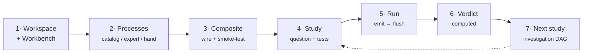

---
tags:
  - getting-started
  - study
  - composite
---
# A worked end-to-end example

This chapter follows one question all the way through the framework: from an empty
directory to a graded study with a computed verdict, and on to the next study it seeds.
It is a map, not a copy-paste script — each step links to the chapter that covers it in
depth, and the exact command surface evolves, so confirm specifics against your installed
`/viva-*` skills and a live workspace.

!!! info "On this page"
    **Assumes** you've skimmed [Studies](../investigate/studies.md) and have `uv`
    plus the `viva-superpowers` plugin installed. · **You'll learn** how one
    question travels the whole loop — from an empty directory to a scaffolded
    workspace, a composite, graded runs, a computed verdict, and the next study
    it seeds.

!!! tip "The shape of the loop"
    Every step below is one hop of the discovery loop from
    [What is Vivarium?](../foundations/what-is-viva-eco.md): **Question → Composite → Run →
    Verdict → Next.** If you internalize that shape, the individual commands are just
    details.

The running example is a small microbial-growth question, in the spirit of the
**Spatio-Flux** reference models and the **v2ecoli baseline** showcase: *does our cell
composite hold a steady exponential growth rate under a glucose-replete medium?*

## 0. Prerequisites

You need `uv` and (for the AI-driven path) the `viva-superpowers` Claude Code plugin
installed. See [Install & deploy](install-and-deploy.md) for the full setup, including the
Docker and Kubernetes paths.

```bash
uv --version          # the workspace toolchain
# the /viva-* skills are provided by the viva-superpowers plugin
```

## 1. Scaffold a workspace and start the Workbench

A **workspace** is a directory with a `workspace.yaml` and a `viva_<pkg>/` Python package
exposing `build_core()`. Scaffold one from the template, then start the server that every
later step drives.

```bash
# scaffold (see /viva-workspace for the three modes)
#   → creates workspace.yaml + viva_<pkg>/ + investigations/ + studies/
# then start the dashboard server (alias: vwb)
vivarium-workbench serve --workspace .
```

The server writes its live URL to `.pbg/server/server-info`; agents resolve it from there
rather than hardcoding a port. Open the printed URL and you land in the
[Workbench](../investigate/workspaces-and-workbench.md) — one workspace per browser tab,
with the side rail (Resources · Catalog · Processes · Studies · Runs · Analysis).

!!! note "Two preconditions"
    Almost every `/viva-*` skill assumes **a workspace** and **a running Workbench**. If
    either is missing, fix that first — see
    [Working with AI agents](../investigate/working-with-agents.md).

## 2. Get the processes you need

A model is assembled from [Processes and Steps](../compute/processes-and-steps.md). You get
them three ways:

<div class="viva-grid" markdown>

<div class="viva-card" markdown>
### Install from the catalog
Browse and install existing community modules (processes + composites + their deps) with
`/viva-catalog`. This is the fastest path when the science already exists.
</div>

<div class="viva-card" markdown>
### Wrap a simulator
Use `/viva-expert` to wrap an upstream simulator as a real, bridged `Process` — its heavy
mode even spins up a sibling `viva-<name>/` repo with tests and a showcase. See the
[Skill reference](skills.md).
</div>

<div class="viva-card" markdown>
### Write one by hand
Subclass `Process`, implement `inputs()`/`outputs()`/`update()`, and register it with
`core.register_link(...)`. See [Processes & Steps](../compute/processes-and-steps.md).
</div>

</div>

If you only have an interface in mind but not the mechanism yet, start with a
[draft process](../compute/templates-and-draft-processes.md): it declares the ports but
stays inert and shows as <span class="pill draft">DRAFT</span> until you supply the dynamics.

## 3. Build and smoke-test a composite

Wire your processes and stores into a [composite](../compute/composites-and-wiring.md) — a
`state` tree of `process`/`step` nodes whose ports are wired to shared-store paths. Add an
[emitter](../compute/emitters.md) so the run leaves a trajectory behind.

Smoke-test it for a few steps before attaching any science to it:

```bash
# run a composite from the catalog for N steps and report emitted observables
# (this is what /viva-run does under the hood: POST /api/composite-test-run)
```

A green smoke test means the wiring type-checks and the composite is
[ground](../compute/templates-and-draft-processes.md) (no unfilled required sites) — it is
ready to carry a question.

## 4. Author the study

Now wrap the question around the composite. A [study](../investigate/studies.md) is
`study.yaml`: one question, one emit-contract, one pass/fail bar. Use `/viva-study` (which
canonicalizes the file and records provenance) rather than hand-editing.

```yaml
# investigations/<inv>/studies/glucose-growth/study.yaml  (illustrative shape — confirm
# field names against a live workspace; see the Schema reference)
schema_version: 4
purpose:
  question: Does the cell composite hold steady exponential growth in glucose-replete medium?
  expected_outcome: growth rate stays within the measured band for every generation
simulation_set:
  - base_model: cell_baseline        # which composite to run
    condition: glucose_replete
    seeds: [0, 1, 2]
    duration: 3 generations
readouts:
  - name: growth_rate
    store_path: [cell, growth_rate]  # the emit contract: a name tied to an exact store path
behavior_tests:
  - name: steady_exponential_growth
    classification: primary
    measure: { kind: generation_average, path: growth_rate }
    pass_if: { op: in_range_every_generation, low: 0.30, high: 0.55 }
    cites: [SomeReference2024]
pipeline_gate:
  prerequisites: []                  # this study's place in the investigation DAG
```

The five join fields — `simulation_set`, `readouts` (the emit contract), `behavior_tests`,
plus baselines and variants — are what tie the study to the composite. See
[Studies](../investigate/studies.md) for each field, and
[Rigor & the evidence engine](../investigate/rigor-and-evidence.md) for how to make a
behavior test honest (an acceptance band cited to the literature via `/viva-cite-bands`).

## 5. Run, emit, analyze, visualize, grade

With the study authored, run it. The run advances the composite through its
[tick lifecycle](../compute/composites-and-wiring.md), the emitter records the wired state,
and the two-phase [flush network](../investigate/analyses-visualizations-report-cards.md)
fires: an extractor normalizes the emitted data, then analysis, visualization, and
report-card Steps write their artifacts.

- **Analyses & visualizations** attach figures and tables to the run; author a bespoke one
  with `/viva-viz`. They surface on the Analysis rail and in each run's
  [Results view](../investigate/analyses-visualizations-report-cards.md).
- **Report cards** grade the `behavior_tests` and render a category scorecard, reused by the
  study's Tests tab.

The verdict is **computed from the run's outcomes, never hand-set**. A test resolves to one
of:

| Verdict | Meaning |
|---|---|
| <span class="pill pass">✓ within_tol</span> | measured value is inside the acceptance band |
| <span class="pill draft">≈ drift</span> | close, but outside tolerance — needs attention |
| <span class="pill fail">✗ mismatch</span> | measured value contradicts the band |
| <span class="pill draft">– ungraded</span> | no run yet, or the readout didn't resolve |

## 6. Read the verdict and seed the next study

The study rolls its test outcomes up into a study **verdict** and a **readiness** signal
(the count of open gaps before the verdict is trustworthy). Read it on the study page — and
read *why*: divergences between what you authored and what the code computed are the
dashboard's headline (see the authored-vs-computed parallel slots in
[Rigor & the evidence engine](../investigate/rigor-and-evidence.md)).

A verdict is not the end; it tells you what to ask next. If growth held, the next study
might perturb the medium; if it drifted, the next study calibrates a parameter. Either way:

!!! quote ""
    New science is a **new study**, not a patch to the model.

## 7. Group studies into an investigation

Several such studies accumulate into an [investigation](../investigate/investigations.md) —
a gated DAG under one research question, living on its own git branch/worktree. Each study
declares its `pipeline_gate.prerequisites`; the dependency edges are computed at render
time, and since the investigation compiles to a composite, a study's prerequisites are just
store wiring. When you are ready, `/viva-report` audits and renders the investigation, and
the [Working with AI agents](../investigate/working-with-agents.md) division of labor
applies: agents build and run in parallel; you own the framing, the verdicts, and the merge.

## The whole loop, at a glance



## Reference runs to study

Two published investigations are worth reading as fully-worked exemplars of this loop:

- **Spatio-Flux** — the paper's reference application: microbial-ecosystem simulations
  combining kinetic equations, dynamic FBA, and spatial processes. The clearest example of
  *composition across formalisms*.
- **The v2ecoli baseline showcase** — from raw sources to a calibrated whole cell, showing
  the study/investigation spine at scale.

---

**Next:** [Glossary](glossary.md) — every term in one place.
